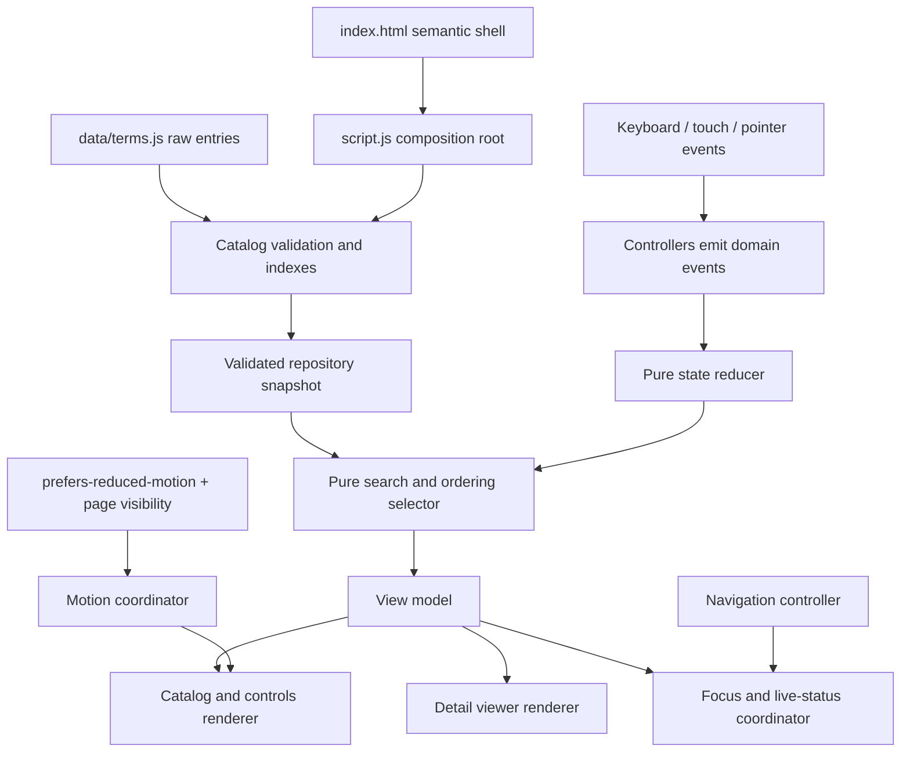
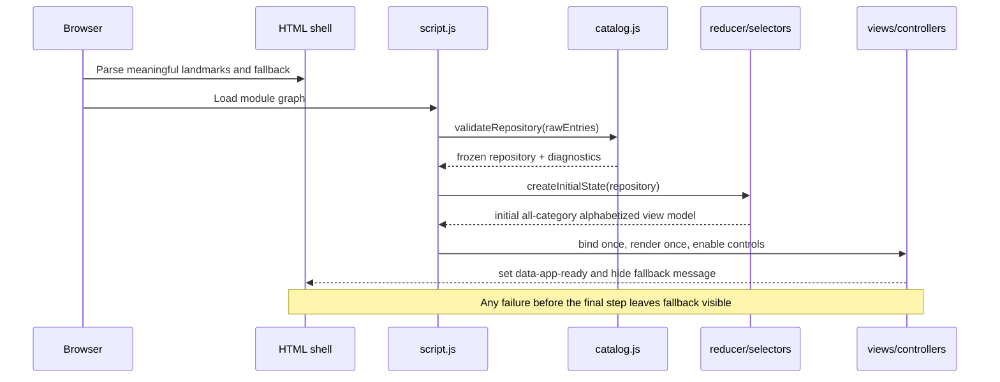
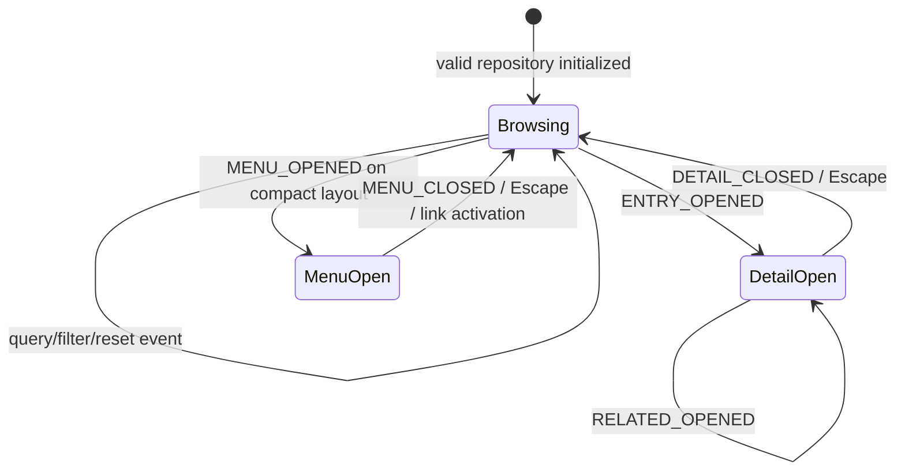
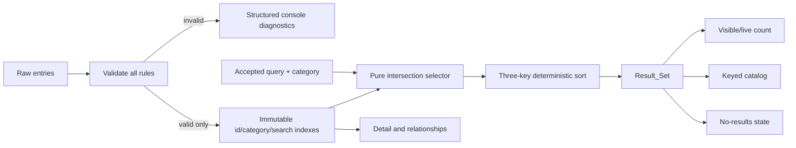

# Technical Design: Signal & Syntax

## Overview

“Signal & Syntax” is an original, single-page educational dictionary for concepts used in AI-assisted software development. It replaces the current studio presentation while retaining the existing static entry points (`index.html`, `styles.css`, and `script.js`). The experience combines an editorial introduction, fast search and category filtering, a responsive term grid, accessible term-detail dialogs, related-term exploration, a compact navigation mode, and restrained layered motion.

The supplied [AI Coding Dictionary](https://www.aicodingdictionary.com/) is treated only as a broad benchmark for discoverability and finish. No reference branding, copy, assets, layout composition, source code, or motion sequence is an implementation input. The project identity, content, visual language, and choreography below are independently specified.

### Goals

- Deliver all required content and interactions as a static, progressively enhanced site with no application backend.
- Keep content independent from markup through one validated repository of at least 12 original entries across at least 3 categories.
- Make search, filtering, ordering, reset, content validation, and interaction transitions deterministic and independently testable.
- Provide equivalent keyboard, touch, and pointer operation, including robust focus management and status announcements.
- Create polished motion without delaying controls, and remove nonessential motion when the operating system requests it.
- Stay within the specified transfer, responsiveness, accessibility, and visual-stability budgets.
- Keep every implementation file, test, asset, manifest, and spec artifact within `/Users/ankitkumar/Desktop/CODE/activity`.

### Non-goals

- Accounts, saved terms, analytics, a backend API, a CMS, user-submitted content, or professional advice.
- Runtime loading of content from the network.
- Reusing the current Three.js scene, Google Fonts request, contact form, studio copy, or studio information architecture.
- Deep-linking or browser-history management for open entries in the foundation release.
- Reproducing any expressive element of the reference site.

### Independent Experience Direction

The visual system uses a “technical field-notes” metaphor rather than a conventional glossary clone:

- **Identity:** “Signal & Syntax” with the descriptor “A field guide to AI-assisted building.”
- **Palette:** warm paper (`#F7F3E8`), blue-black ink (`#152033`), deep violet accent (`#5A36A3`), rust signal (`#9B3F31`), and explicit high-contrast focus blue (`#005FCC`). Soft tints are decorative only; text and control boundaries use contrast-tested solid tokens.
- **Typography:** a system serif stack for display headings and a system sans stack for controls and body copy. Small index labels use the sans stack with increased tracking. No external font request is needed.
- **Composition:** a centered content rail crossed by slim “index” rules, offset term numbers, and CSS-generated signal rings. Cards use consistent geometry rather than the staggered portfolio layout in the current site.
- **Motion signature:** sequential “indexing” reveals, small vertical card entrances, restrained detail-sheet transitions, and a bounded pointer-responsive signal field. There is no WebGL, custom cursor, scroll hijacking, or copied choreography.

Final copy and all 12+ demonstration entries are written specifically for this project and pass the originality review described below.

### Research Findings Informing the Design

- The [WAI-ARIA Authoring Practices modal-dialog pattern](https://www.w3.org/WAI/ARIA/apg/patterns/dialog-modal/) calls for focus to enter the dialog, Tab and Shift+Tab to remain within it, Escape to close it, and focus to return to the invoker. Because term explanations contain structured paragraphs and lists, the dialog title—not a long `aria-describedby` string—is the initial focus target.
- [IntersectionObserver](https://developer.mozilla.org/en-US/docs/Web/API/IntersectionObserver/IntersectionObserver) supports asynchronous threshold-based viewport observation, so one observer at `threshold: 0.15` can trigger each card reveal once without scroll-position polling.
- [`prefers-reduced-motion`](https://developer.mozilla.org/en-US/docs/Web/CSS/@media/prefers-reduced-motion) is broadly available and represents a request to remove or replace nonessential movement. Both CSS and JavaScript behavior therefore react to the media query, including changes made while the page is open.
- The [Page Visibility API](https://developer.mozilla.org/en-US/docs/Web/API/Page_Visibility_API) reports when a page becomes hidden. The decorative animation coordinator stops its animation-frame loop on `visibilitychange`, rather than relying only on browser throttling.
- [`String.prototype.normalize`](https://developer.mozilla.org/en-US/docs/Web/JavaScript/Reference/Global_Objects/String/normalize) resolves canonically or compatibly equivalent Unicode sequences to a common form. Search comparison uses NFKC plus locale-stable lowercasing while preserving authored display text.
- [Core Web Vitals guidance](https://web.dev/articles/vitals) identifies LCP at or below 2.5 seconds and CLS at or below 0.1 as good experience thresholds. The design also honors the stricter project budgets for TBT and transferred resources.
- [fast-check](https://fast-check.dev/docs/introduction/getting-started/) provides seeded generated values and shrinking while remaining test-runner agnostic. It is paired with Node’s test runner for pure repository, search, and state-transition properties; the implementation dependency is pinned exactly to `fast-check@4.9.0` with a lockfile.
- [WCAG 2.2](https://www.w3.org/TR/WCAG22/) is the normative accessibility baseline; automated checks supplement rather than replace keyboard, zoom, screen-reader, and visual review.

Research summaries are paraphrased for licensing compliance.

## Architecture

### Architectural Style

The implementation is a native ES-module static application with progressive enhancement:

1. `index.html` supplies semantic landmarks, the complete explanatory shell, a pre-existing status region, and a visible static fallback.
2. `data/terms.js` supplies authored data only; it has no DOM or controller behavior.
3. Pure modules validate/index content, normalize search inputs, derive ordered result sets, and reduce application events into state.
4. View modules render from immutable repository/state snapshots and emit semantic events through callbacks.
5. Navigation, accessibility, and motion modules enhance native HTML without owning business data.
6. If enhancement cannot initialize, the site identity, purpose, educational disclaimer, and “interactive catalog unavailable” message remain readable.

No runtime framework or third-party runtime library is required. This keeps failure modes small, enables direct tests of core logic, and removes the current remote font and Three.js dependencies.



### Strict Project Boundary and Proposed Files

All paths are descendants of `/Users/ankitkumar/Desktop/CODE/activity`; no absolute path is embedded in browser code. A tool or implementation operation must resolve both source and destination paths before mutation and abort the whole operation when either path is outside or cannot be resolved beneath the project root.

```text
/Users/ankitkumar/Desktop/CODE/activity/
├── index.html
├── styles.css
├── script.js
├── package.json                     # test tooling only; exact versions
├── package-lock.json                # reproducible test dependency graph
├── data/
│   └── terms.js
├── styles/
│   ├── tokens.css
│   ├── base.css
│   ├── layout.css
│   ├── components.css
│   ├── motion.css
│   └── responsive.css
├── scripts/
│   ├── catalog.js
│   ├── search.js
│   ├── navigation.js
│   ├── interactions.js
│   ├── motion.js
│   └── accessibility.js
├── tests/
│   ├── catalog.test.mjs
│   ├── search.test.mjs
│   └── interactions.test.mjs
└── .kiro/specs/ai-coding-dictionary-inspired-site/
    ├── .config.kiro
    ├── requirements.md
    └── design.md
```

`assets/` is omitted in the foundation release because the design uses system fonts and CSS-generated decoration. If a later approved implementation adds a font, icon, or image, only the corresponding nonempty `assets/fonts/`, `assets/icons/`, or `assets/images/` branch is created, with retained license evidence and required attribution inside the project root. `tasks.md` is intentionally absent during this design phase.

`styles.css` is the CSS entry point and imports the six concern-based files in dependency order. `script.js` is loaded with `type="module"` and is the only JavaScript entry point referenced by `index.html`; it imports data and behavior modules. A plain static host is sufficient—there is no project-owned backend process.

### Initialization and Failure Isolation



Boot order is deliberately transactional. Event listeners are attached through controller `mount` methods that return cleanup functions. Controls remain disabled and the fallback status remains visible until validation, initial selection, rendering, and controller mounting all succeed. On failure, already-mounted controllers are cleaned up, an actionable console error is reported, and the readable shell remains.

### State and Data Flow

The composition root owns one immutable `AppState` snapshot. Controllers never mutate DOM and business state independently; they dispatch a single domain event. The reducer creates the next state, selectors derive `Result_Set`, and one render transaction updates controls, count, catalog, no-results state, selected markers, and details. The accessibility coordinator receives the previous and next view models so it can announce a result change exactly once and avoid announcements for identity transitions.



Business state is preserved during viewport/orientation changes because breakpoints are CSS concerns. The only viewport-dependent JavaScript state is compact-menu openness; crossing into expanded navigation closes the compact disclosure without changing query, filter, result order, or selected entry.

### Key Design Decisions

| Decision | Rationale |
|---|---|
| Native ES modules and no runtime framework | The feature is small, static, and dominated by pure transformations; this minimizes transfer, startup, and dependency risk. |
| System font stacks and CSS-generated decoration | Avoids licensing uncertainty, font flashes, remote failure, and unnecessary transfer. |
| Native `<dialog>` with an in-project capability fallback | Gives current browsers modal semantics and inert background behavior while preserving required operation if the capability is unavailable. |
| Radio inputs for category choice | “All” and one category are mutually exclusive; native radio semantics and arrow-key behavior are clearer than a custom button group. |
| A pure reducer plus pure selectors | Makes idempotence, commutativity, and state preservation executable properties and prevents view-specific state drift. |
| One delegated catalog listener | Avoids hundreds of listeners, supports keyed rerenders, and guarantees one activation path for mouse, touch, and keyboard-generated clicks. |
| No debounce on search | Up to 500 small records can be filtered synchronously inside the 100 ms budget; delayed updates would reduce perceived responsiveness. |
| Modal details retain the original opener across related-term navigation | Dismissal can always return to the catalog control that opened the viewer, as required. |
| CSS breakpoints own reflow | Orientation and zoom cannot reset business state, and layout remains functional when JavaScript fails. |

## Components and Interfaces

### Module Responsibilities

| File | Responsibility | Must not own |
|---|---|---|
| `index.html` | Semantic landmarks, headings, navigation destinations, browse-control shell, catalog host, dialog shell, contextual information, footer, skip link, live region, fallback | Entry duplication, inline event handlers, decorative text exposed to assistive technology |
| `styles.css` | Imports concern-based CSS in deterministic order | Component rules of its own |
| `styles/tokens.css` | Color, type, spacing, z-index, measure, breakpoints-as-documentation, and motion custom properties | Selectors tied to component DOM |
| `styles/base.css` | Reset, typography, native element defaults, focus baseline, hidden/fallback states | Layout-specific grids |
| `styles/layout.css` | Section rails, containers, sticky header, grid, dialog geometry | Motion timing or input-mode adaptation |
| `styles/components.css` | Navigation, search, filters, cards, result status, no-results panel, dialog, related controls, footer | Breakpoint overrides |
| `styles/motion.css` | Explicit transition properties, reveal states, intro staging, signal-field states, reduced-motion overrides | Layout breakpoints |
| `styles/responsive.css` | Exact grid breakpoints, compact navigation, zoom-safe reflow, touch/coarse-pointer adaptations | Business-state visibility |
| `data/terms.js` | Original raw `Dictionary_Entry[]` export | Markup, HTML strings, behavior, remote fetches |
| `script.js` | Composition root, transactional initialization, store/dispatch loop, cleanup | Search algorithms or component markup details |
| `scripts/catalog.js` | Repository validation, indexing, category derivation, deterministic sorting, keyed card rendering | Query/filter state transitions |
| `scripts/search.js` | Query truncation/normalization, pure filter selector, result-state reducer portions | DOM reads or writes |
| `scripts/navigation.js` | Section focus/scroll, sticky catalog access, compact disclosure, Escape behavior | Catalog or detail state |
| `scripts/interactions.js` | Event delegation, detail-dialog lifecycle, related navigation, opener tracking, interaction reducer | Repository validation |
| `scripts/motion.js` | Intro staging, one-time observers, bounded pointer field, visibility/media-query lifecycle | Required content visibility |
| `scripts/accessibility.js` | Live-region writes, focus placement/restoration, dialog fallback trap, associated constraint errors | Business filtering decisions |

### Composition Root Contract

```js
/** @typedef {{ type: string, payload?: unknown }} AppEvent */

/**
 * Initializes all modules or leaves the static fallback intact.
 * @param {Document} document
 * @param {readonly RawDictionaryEntry[]} rawEntries
 * @returns {() => void} cleanup
 */
export function bootstrap(document, rawEntries) {}
```

`bootstrap` constructs dependencies explicitly and passes callbacks such as `onQueryInput`, `onFilterChange`, `onEntryOpen`, and `onClose`. Modules do not import one another’s singleton state. The dispatch path is:

```text
DOM event -> semantic callback -> dispatch(AppEvent)
          -> reduce(previousState, event)
          -> selectViewModel(repository, nextState)
          -> render(previousViewModel, nextViewModel)
```

Identity events return the previous state object. Rendering and live announcements are skipped when their relevant derived values are unchanged.

### Semantic Document Shell

The source order is fixed:

1. visible-on-focus skip link;
2. site `<header>` with identity, section `<nav>`, persistent catalog-access link, and compact menu control;
3. `<main id="main-content" tabindex="-1">` containing:
   - introduction section with the sole `<h1 id="top">Signal & Syntax</h1>`, one-sentence purpose, and direct browse link;
   - browse-controls section with `<h2 id="browse-heading">`, labeled search input, helper/error text, category `<fieldset>`, visible result status, and reset;
   - catalog section immediately afterward with `<h2 id="catalog-heading">`, grid host, and persistent no-results host;
   - contextual-information section with control instructions and educational-not-professional-advice statement;
4. site `<footer id="footer">` with identity, purpose, and return-to-top control;
5. the reusable term-detail `<dialog>` as an auxiliary overlay.

Navigation exposes exactly the five required destinations: introduction, browse controls, catalog, contextual information, and footer. Every destination has a real rendered heading. Decorative rings and index marks are `aria-hidden="true"` and cannot receive focus.

The initial HTML contains the site title, purpose, context/disclaimer, and a visible `#catalog-fallback` message. Search and filter controls begin disabled. Successful initialization enables them and adds `data-app-ready` to the root; CSS then hides the fallback. `<noscript>` repeats the unavailable message for explicit no-script cases without being the sole fallback mechanism.

### Search Controls and Result Rendering

The search input uses a visible `<label>`, `type="search"`, `autocomplete="off"`, `spellcheck="false"`, and `aria-describedby` pointing to persistent help text plus a conditionally visible limit error. Native `maxlength` is not used because it counts UTF-16 code units rather than the required Unicode code points. The input controller:

1. converts the browser value to Unicode code points;
2. retains the first 200;
3. writes the accepted prefix back only when truncation occurred;
4. dispatches the trimmed accepted value;
5. shows a visible associated “Maximum 200 characters” error when truncation occurred.

The filter fieldset contains one native radio for “All topics” plus one for every category derived from valid entries. Controls are keyed by the exact category value. Selecting an already active radio creates no state transition.

The catalog renderer owns a cache from entry id to card element. It creates card content with DOM APIs and `textContent`, never content-derived `innerHTML`. A render transaction moves matching card nodes into a `DocumentFragment` in sorted order, removes nonmatching nodes from the rendered grid, then commits once. Each card is an `<article>` containing term, category, short definition, and one `<button>` with:

- a visible action label;
- `data-entry-id`;
- `aria-controls="term-detail"`;
- `aria-expanded="true"` only while that rendered entry is selected, otherwise `false`.

A single grid `click` listener resolves `event.target.closest('[data-entry-id]')`. CSS hover styles are restricted to `@media (hover: hover) and (pointer: fine)` and never dispatch state. Keyboard and touch activation rely on native button-generated `click`, preventing duplicate key/pointer paths.

The no-results host remains at the catalog position. When empty, it contains the current accepted query, the active category label, and a reset button. When nonempty it is hidden and removed from the accessibility tree with the native `hidden` attribute. Current query and filter are never cleared merely because no match exists.

### Detail Viewer

The viewer is one reusable `<dialog id="term-detail" aria-labelledby="detail-title">`. It contains a close button, title, category, short definition, explanation, optional aliases section, and optional related-terms section. The renderer replaces every entry-specific child on selection and omits—not hides with placeholder copy—empty aliases and related sections.

Opening behavior:

1. Record the catalog opener’s stable entry id and element reference.
2. Set `selectedEntryId` and render all detail fields from the validated repository.
3. Set only the corresponding rendered catalog button to `aria-expanded="true"` and selected styling.
4. Call `showModal()` when available; otherwise activate the in-project modal fallback.
5. Focus `#detail-title[tabindex="-1"]` so structured content starts at a meaningful location.

Related controls store only a target entry id. Activation resolves the id against the validated repository and replaces all detail content without closing the viewer. The original catalog opener remains the return target. If a relationship is unexpectedly unresolved at render time, that control is omitted while all other content remains.

Dismissal through the close button, Escape/cancel event, or fallback Escape handler follows one path, so it runs exactly once. It closes the viewer, clears `selectedEntryId`, resets expanded/selected styling, and focuses the original rendered catalog control. If that element is no longer connected, the controller queries by stable entry id; if still unavailable, it focuses the catalog heading as a defensive fallback.

The native dialog supplies inert background and contained tab navigation in supported browsers. The fallback adds `role="dialog"`, `aria-modal="true"`, marks background siblings inert (with a local tabindex-preservation fallback if `inert` is missing), wraps Tab/Shift+Tab between first and last tabbable elements, and restores all prior attributes on close.

### Navigation System

The sticky header always includes an unobscured “Browse terms” link. On widths below 768 CSS pixels it remains visible beside a compact menu button, so catalog access never depends on first opening the menu. Expanded links are hidden and the disclosure panel provides the same five destinations.

Section activation uses one function:

```js
/**
 * @param {HTMLElement} destinationHeading
 * @param {{ reducedMotion: boolean }} preferences
 */
export function navigateToHeading(destinationHeading, preferences) {}
```

It closes the compact menu first, focuses the heading with `preventScroll`, and calls `scrollIntoView` with `behavior: 'auto'` under reduced motion or `'smooth'` otherwise. CSS `scroll-margin-block-start` equals the maximum sticky-header height, keeping the heading unobscured. Focus occurs immediately and smooth scrolling is constrained by browser behavior to complete within the one-second acceptance window. Skip-link activation always uses immediate scrolling. The return-to-top target is the sole H1.

The compact button keeps `aria-expanded` and panel `hidden` synchronized. Escape closes an open panel and returns focus to the button; link activation closes it before navigation. A desktop media-query transition closes the compact panel without changing query, active filter, result ids, or selected entry.

### Interaction and Motion Design

Motion tokens are centralized and use explicit properties rather than `transition: all`:

| Layer | Token | Value | Use |
|---|---:|---:|---|
| Direct feedback | `--motion-feedback` | 160 ms | border, color, underline, small icon response |
| State transition | `--motion-state` | 300 ms | menu, no-results, detail sheet |
| Entrance | `--motion-entrance` | 560 ms | introduction and first card reveal |
| Stagger | `--motion-stagger` | 70 ms | introduction source-order starts |
| Card distance | `--reveal-distance` | 18 px | one-time vertical entrance |
| Pointer displacement | JS clamp | 18 px | decorative signal-field offset |
| Pointer return | `--motion-return` | 420 ms | decoration returns to rest |

The independent choreography has four layers:

1. **Initial indexing:** eyebrow, H1, purpose, and browse link become visible in source order with 70 ms between starts and a 560 ms opacity/vertical transition.
2. **Catalog reveal:** one `IntersectionObserver` at 0.15 marks each card `data-revealed` once. Cards start at opacity 0 and `translateY(18px)`, then remain in the final state when removed from observation. A capability failure reveals all cards immediately.
3. **State response:** result/no-result content and the detail sheet use 300 ms opacity plus at most 12 px movement. DOM and ARIA state commit before the transition begins, so the first response is observable within one frame and never waits for animation completion.
4. **Ambient signal field:** three CSS-generated rings behind the introduction read two CSS variables updated by one animation-frame coordinator. Fine-pointer movement is normalized and clamped to 18 px. A slow independent drift is calculated in the same loop; no flashing, rapid alternation, canvas, or per-card loop is used.

The coordinator runs only while all of these are true: the page is visible, reduced motion is inactive, a fine pointer is present, and the signal field intersects the viewport. Pointer exit sets the target to zero and CSS interpolation returns to rest within 420 ms. `visibilitychange`, media-query change, or observer exit cancels the pending frame and writes resting values.

Under reduced motion, CSS makes all reveal targets visible with no delay or transform, disables ambient animation, and limits essential feedback to color/opacity at 80 ms. JavaScript does not create the reveal observer or animation-frame loop, section navigation is immediate, and pointer variables remain zero. Live media-query changes are applied without reload.

### Accessibility Strategy

- Use native landmarks, links, buttons, radios, search input, fieldset/legend, output/status, lists, and dialog before adding ARIA.
- Keep exactly one H1 and sequential H2/H3 nesting; focusable destination headings use `tabindex="-1"` without entering normal tab order.
- Make the skip link the first focusable element and target `#main-content`.
- Use a persistent visible `role="status" aria-live="polite" aria-atomic="true"` result-count element. The renderer writes its text once only when result membership/order changes, not once per card and not for identity events.
- Give every visible-label control an accessible name containing that label. The icon-free foundation avoids unlabeled graphics.
- Apply a 3 px focus ring with at least a 2 px clear offset, never clipped by card/dialog overflow. `:focus-visible` is enhanced with a safe `:focus` fallback.
- Use 44 by 44 CSS-pixel minimum hit areas for all primary controls. Search remains at least 16 CSS pixels on compact widths.
- Keep normal text at 4.5:1 or better and large text, boundaries, and focus indicators at 3:1 or better. Palette tokens are checked in automated accessibility scans and manual high-contrast review before release.
- Never communicate selected, error, hover, or focus state by color alone: use border/underline, text, `aria-expanded`, checked state, and visible error copy.
- Keep decorative layers out of the accessibility tree and noninteractive (`aria-hidden`, `pointer-events: none`).
- Preserve browser zoom, text resizing, native scrolling, native scrollbar behavior, and touch operation without hover prerequisites.
- Treat automated Lighthouse/axe-style results as gates, then perform keyboard-only, VoiceOver/Safari, NVDA/Firefox or equivalent, 200% zoom, and reduced-motion reviews.

### Responsive Behavior

The grid contract is encoded with exact nonoverlapping media ranges and `minmax(0, 1fr)` tracks:

| Viewport width at 100% zoom | Catalog columns | Navigation |
|---:|---:|---|
| 320–767 px | 1 | persistent Browse link + compact menu |
| 768–1199 px | 2 | expanded section links |
| 1200–1599 px | 3 | expanded section links |
| 1600–2560 px | 4 | expanded section links, capped content rail |

Containers use fluid gutters (`clamp(1rem, 3vw, 3rem)`), children use `min-width: 0`, authored strings use `overflow-wrap: anywhere` only where an unbroken token could overflow, and controls wrap rather than scroll horizontally. The long-form explanation is capped at `80ch`. At 200% zoom in a 1280×1024 window, CSS reflow naturally enters the compact one-column presentation and preserves vertical access to every control.

The dialog is a centered sheet with a two-column metadata/content interior where space permits, a single column below 768 px, and viewport-relative maximum block size with native internal scrolling. It never exceeds `calc(100vw - 2rem)`. Orientation changes require no state reconstruction; CSS reflows immediately while the store remains intact.

Coarse/touch-only media queries remove hover-only offsets and expose persistent action labels. No action exists solely in a pseudo-element or hover overlay.

### Performance Strategy

- Remove the existing Three.js CDN script and Google Fonts requests; ship no runtime dependency and no media asset in the foundation release.
- Keep compressed JavaScript below 100 KB, CSS below 75 KB, and all initial resources below 1.5 MB. A release script or CI measurement records compressed byte totals from files beneath the project root.
- Render meaningful text in the initial HTML so LCP is not gated on JavaScript. Use system fonts to avoid late font swaps and reserve fixed geometry for decorative layers.
- Validate and index the repository once. Precompute normalized searchable fields and category/id maps, making each query a linear pass over at most 500 small records followed by deterministic sorting of matches.
- Reuse card nodes, use one fragment commit, delegate events, and avoid layout reads in the render path. Query updates are synchronous and measured from `input` event receipt through count/no-results commit; the target is below 100 ms on the defined Test Device.
- Use one IntersectionObserver for reveals and one for signal-field activity. The only animation-frame loop writes transforms, never layout properties, and is canceled while hidden, reduced, coarse-pointer-only, or offscreen.
- Do not animate width, height, top, left, box-shadow blur, or filters. Restrict animations to opacity and transform and keep layer promotion limited to the active decorative field/dialog.
- If later informative media is approved, include width/height or `aspect-ratio`, meaningful `alt`, and `loading="lazy"` when it begins more than one viewport below the fold. Decorative media failure cannot remove text or controls.
- Run three empty-cache Lighthouse mobile audits against the same static release candidate and gate every run on performance ≥90, accessibility ≥95, LCP ≤2.5 s, CLS ≤0.1, and TBT ≤200 ms.
- Exercise 60 seconds of post-ready idle time with console capture; no timer or ambient loop may produce an uncaught error.

### Originality and Asset Review

Before release, review changed source, visible copy, metadata, visual captures, and motion recordings against this design—not against reference implementation details. The checklist rejects reference names, slogans, definitions, assets, source-derived code, recognizable composition, or choreography. Every non-original asset must have license evidence and attribution retained inside the project root. With no third-party visual assets in the foundation, the asset inventory states “none.” A failed review blocks release but does not trigger automatic rewriting or partial file mutation.

## Data Models

### Dictionary Entry Contract

```js
/**
 * @typedef {Object} RawDictionaryEntry
 * @property {string} id
 * @property {string} slug
 * @property {string} term
 * @property {string} shortDefinition
 * @property {string} explanation
 * @property {string} category
 * @property {string[]} aliases
 * @property {string[]} relatedEntryIds
 */
```

Example shape (illustrative structure only, not final dictionary copy):

```js
{
  id: 'entry-stable-id',
  slug: 'entry-url-token',
  term: 'Entry term',
  shortDefinition: 'One independently written summary sentence.',
  explanation: 'An independently written educational explanation.',
  category: 'Workflow',
  aliases: ['Alternate label'],
  relatedEntryIds: ['another-stable-id']
}
```

Validation does not silently repair authored content. Required text is valid only when it is a string, contains at least one non-whitespace character, and equals its own Unicode `trim()` result. Slugs additionally match `^[a-z0-9]+(?:-[a-z0-9]+)*$`. Arrays must be arrays of trimmed, nonempty strings with no exact duplicate. `id` and slug uniqueness are case-sensitive; every member of a collision is invalid so source order cannot decide a winner.

Validation is multi-pass:

1. **Shape pass:** collect every field/array/slug diagnostic by source index and best available id or slug.
2. **Uniqueness pass:** count ids and slugs and attach collision diagnostics to every conflicting entry.
3. **Relationship pass:** resolve each related id against exactly one surviving id. If an entry becomes invalid, repeat relationship resolution to a fixed point so references never resolve to an entry excluded from the repository.
4. **Release-content pass:** report repository-level failure if fewer than 12 valid entries or fewer than 3 derived categories remain.
5. **Snapshot pass:** freeze valid entries, arrays, indexes exposed as read-only accessors, categories, and diagnostics.

```js
/** @typedef {{ entryRef: string, field: string, rule: string, message: string }} ValidationIssue */

/**
 * @typedef {Object} ValidatedRepository
 * @property {readonly RawDictionaryEntry[]} entries
 * @property {ReadonlyMap<string, RawDictionaryEntry>} byId
 * @property {readonly string[]} categories
 * @property {readonly ValidationIssue[]} issues
 * @property {boolean} meetsFoundationMinimum
 */

/**
 * Excludes invalid entries and reports every observed failed rule.
 * @param {unknown} source
 * @returns {ValidatedRepository}
 */
export function validateRepository(source) {}
```

Diagnostics are emitted once during development with `console.groupCollapsed`, one line per issue, including id, slug, or source position. User-facing rendering receives only `repository.entries`. A defensive detail lookup still omits any unresolved related id without discarding other detail content.

### Search Index and Normalization

Validation creates an internal immutable search record for each valid entry:

```js
/**
 * @typedef {Object} SearchRecord
 * @property {string} id
 * @property {string} category
 * @property {string} normalizedTerm
 * @property {readonly string[]} normalizedAliases
 * @property {string} normalizedShortDefinition
 * @property {string} normalizedCategory
 */
```

```js
export function normalizeForSearch(value) {
  return value.normalize('NFKC').toLocaleLowerCase('en-US');
}

export function compareCodeUnits(left, right) {
  return left < right ? -1 : left > right ? 1 : 0;
}
```

The accepted query is the first 200 Unicode code points of input, trimmed with native Unicode whitespace semantics. Its normalized comparison value is NFKC plus `toLocaleLowerCase('en-US')`. The same normalization is precomputed for term, aliases, short definition, and category. Explanation and related terms are deliberately not searchable because they are outside Requirement 5.4.

Result derivation includes an entry exactly when:

```text
(activeFilter is ALL OR entry.category === activeFilter)
AND
(query is empty OR normalized query is a substring of at least one searchable field)
```

Sorting is deterministic and locale-environment independent:

1. compare NFKC + `en-US` lowercased term by JavaScript code-unit order;
2. if equal, compare original case-sensitive term by code-unit order;
3. if equal, compare case-sensitive id by code-unit order.

The selector never mutates repository order or the caller’s state.

### Application State

```js
/** @typedef {null | string} CategoryFilter */ // null means all categories

/**
 * @typedef {Object} AppState
 * @property {string} query                 // accepted, trimmed display query
 * @property {CategoryFilter} activeFilter  // exact category or null
 * @property {string | null} selectedEntryId
 * @property {string | null} detailOpenerId
 * @property {boolean} detailOpen
 * @property {boolean} compactMenuOpen
 */
```

Motion environment (`reducedMotion`, fine-pointer capability, page visibility, revealed-card ids) is intentionally held by `motion.js`, not in business state. Layout width is entirely CSS-driven. This separation ensures orientation changes cannot reconstruct or lose query, filter, result, or selection state.

```js
/**
 * @typedef {Object} ViewModel
 * @property {string} query
 * @property {CategoryFilter} activeFilter
 * @property {readonly RawDictionaryEntry[]} results
 * @property {RawDictionaryEntry | null} selectedEntry
 * @property {number} resultCount
 * @property {boolean} showNoResults
 */

export function reduceAppState(state, event, repository) {}
export function selectViewModel(repository, state) {}
```

Supported domain events are `QUERY_CHANGED`, `FILTER_CHANGED`, `RESET`, `ENTRY_OPENED`, `RELATED_OPENED`, `DETAIL_CLOSED`, `MENU_OPENED`, and `MENU_CLOSED`. `RESET` changes only query/filter and leaves a closed detail state; because the modal prevents access to browse controls while open, reset cannot race an open viewer. Reapplying the current filter, closing an already closed surface, or resetting an already reset state returns the same object.

### State Transition Rules

| Event | Precondition | State effect | Derived effect |
|---|---|---|---|
| `QUERY_CHANGED` | accepted prefix available | replace trimmed query | filter by query + current category, then sort |
| `FILTER_CHANGED` | exact derived category or `null` | replace active filter | filter by category + current query, then sort |
| `RESET` | any browsing state | query `''`, filter `null` | all valid entries sorted |
| `ENTRY_OPENED` | id exists in repository | select id, store opener id, open detail | render complete selected content |
| `RELATED_OPENED` | detail open and id resolves | replace selected id only | replace all detail-specific content |
| `DETAIL_CLOSED` | detail open | clear selection/opener and close | remove selected marker; restore opener focus before discarding DOM reference |
| `MENU_OPENED` | compact mode | menu true | `aria-expanded=true`, panel shown |
| `MENU_CLOSED` | menu open | menu false | panel hidden, `aria-expanded=false` |

### Data-Flow Invariants



Core invariants are: rendered catalog ids equal ordered result ids; count equals result length; no invalid entry reaches a result; at most one rendered catalog control is selected; detail fields come from one repository entry; reset yields the initial query/filter/result projection; and layout/motion environment changes do not alter business state.

### PBT Applicability Assessment

The feature is suitable for property-based testing in repository validation, Unicode query handling, deterministic ordering, filtering, reset/idempotence, filter/query commutativity, and pure interaction-state transitions because these are low-cost functions with large structured input spaces and universal invariants. PBT is not used to test visual composition, browser-native dialog behavior, asset loading, Lighthouse output, or subjective motion quality; those require example-based, integration, accessibility, visual, or performance checks.

## Correctness Properties

*A property is a characteristic or behavior that should hold true across all valid executions of a system-essentially, a formal statement about what the system should do. Properties serve as the bridge between human-readable specifications and machine-verifiable correctness guarantees.*

The reflection step consolidated overlapping field-validation criteria into repository soundness properties and combined query/category membership criteria into one model-based selection property. The remaining properties each target a distinct failure mode; visual rendering, external browser behavior, and fixed release checks are intentionally covered later by example, integration, accessibility, performance, and smoke tests.

### Property 1: Accepted entries satisfy the local schema

For all raw content repositories, every entry admitted by `validateRepository` contains all required text and array fields, each required text value is nonblank and already trimmed, each slug matches the required lowercase single-hyphen grammar, both collection fields are arrays, and neither collection contains an exact duplicate; valid values are preserved rather than rewritten.

**Validates: Requirements 4.1, 4.2, 4.4, 4.6, 4.7, 13.6**

### Property 2: Admitted repositories have global identity and relationship integrity

For all raw content repositories, the admitted entries have pairwise-unique case-sensitive ids and slugs, and every admitted related-entry id resolves to exactly one admitted entry; entries that are otherwise valid and independent of a collision or invalid relationship remain admitted.

**Validates: Requirements 4.3, 4.5, 4.8, 4.14, 13.6**

### Property 3: Rejection diagnostics are complete and attributable

For all raw entries rejected by any modeled schema, uniqueness, or relationship rule, validation returns at least one diagnostic for every failed rule, and every diagnostic identifies its source entry by id, slug, or source position; no rejected entry appears in the validated repository.

**Validates: Requirements 4.14, 4.15, 13.6**

### Property 4: Catalog ordering follows the deterministic three-key comparator

For all valid entry collections, sorting preserves every entry exactly once and every adjacent pair is ascending first by normalized case-insensitive term, then by original case-sensitive term, then by case-sensitive id.

**Validates: Requirements 4.13**

### Property 5: Initial browsing state is the complete ordered repository

For all valid repositories, initialization produces an empty query, the all-categories filter, and a result sequence containing every repository entry exactly once in deterministic catalog order.

**Validates: Requirements 5.1**

### Property 6: Query acceptance trims and enforces the Unicode code-point limit

For all Unicode input strings, the accepted query equals the Unicode-trimmed first 200 code points of the supplied input, contains at most 200 code points, and reports a limit violation exactly when supplied content exists beyond that accepted 200-code-point prefix.

**Validates: Requirements 5.2, 5.17**

### Property 7: Normalization-equivalent queries are result invariant

For all valid repositories, active filters, and query pairs with equal NFKC and `en-US` lowercase normalized values, the two derived result sequences have identical membership and order.

**Validates: Requirements 5.3, 5.13, 13.7**

### Property 8: Search and category selection equal the independent intersection model

For all valid repositories, accepted queries, and active category filters, the derived result sequence contains all and only entries whose exact category satisfies the filter and whose specified searchable fields satisfy normalized substring matching (or all filter-permitted entries for an empty query), ordered by the deterministic catalog comparator.

**Validates: Requirements 5.4, 5.5, 5.6, 5.7, 5.8**

### Property 9: Reset restores the initial browsing projection

For all valid repositories and reachable browsing states, one reset produces an empty query, the all-categories filter, and the same complete ordered result sequence produced by initialization.

**Validates: Requirements 5.12**

### Property 10: Reapplying the active filter is idempotent

For all valid repositories, reachable browsing states, and active filters, applying the current filter again produces the same state and identical result membership and order as applying it once.

**Validates: Requirements 5.14, 13.7**

### Property 11: Query and filter application are confluent

For all valid repositories, starting browsing states, accepted queries, and valid category filters, applying query then filter produces the same final query, filter, result membership, and result order as applying filter then query.

**Validates: Requirements 5.15, 13.7**

### Property 12: Reset is idempotent

For all valid repositories and reachable browsing states, applying reset repeatedly produces the same state and result projection as applying reset once.

**Validates: Requirements 5.16, 13.7**

### Property 13: Detail projection is exact and replacement-only

For all valid repositories and selected entries, the detail model contains exactly that entry’s term, category, short definition, explanation, aliases, and resolvable related entries; replacing any prior selection with that entry leaves no entry-specific value from the prior selection.

**Validates: Requirements 6.1, 6.8**

### Property 14: Related navigation selects the referenced entry without changing the opener

For all valid repositories, open detail states, and resolvable related-entry controls, activating the control keeps the viewer open, replaces the selected id with exactly the referenced id, and preserves the original catalog opener id.

**Validates: Requirements 6.4**

### Property 15: Catalog selected state is unique and correctly keyed

For all ordered result-id sequences and selected-entry ids, selected-state derivation marks at most one catalog control, and any marked control has an id exactly equal to the selected-entry id.

**Validates: Requirements 6.5**

### Property 16: Pointer decoration displacement is bounded

For all finite pointer coordinates and positive viewport dimensions, the signal-field mapping returns finite displacement values within the designed 18 CSS-pixel bound from rest on each axis and therefore never exceeds the required 24 CSS-pixel maximum.

**Validates: Requirements 8.7**

### Property 17: Result announcements are singular and non-focusing

For all previous and next ordered result-id sequences, the accessibility update planner emits exactly one polite result-count update and no focus command when the sequences differ, and emits no result update when the sequences are identical.

**Validates: Requirements 10.9**

## Error Handling

The site follows progressive enhancement: content remains understandable without JavaScript, partial content errors do not take down valid entries, and optional visual behavior never gates controls.

| Failure | Detection | User behavior | Developer signal / recovery |
|---|---|---|---|
| Proposed file path is outside or cannot be proven inside Project_Root | Resolve source and destination before any operation | No project file changes | Abort whole operation and identify the rejected path; do not partially write |
| `data/terms.js` export is not an array | Repository initialization guard | Static shell and unavailable message remain; controls stay disabled | One console error naming the expected top-level shape |
| One or more entries violate local schema/uniqueness/relationships | Multi-pass validator | Invalid entries are omitted; valid entries remain browsable | One grouped diagnostic set with every rule and entry reference |
| Foundation minimum falls below 12 valid entries or 3 categories | Repository-level release validation | Valid content may render in development; release is blocked | Repository diagnostic identifies actual counts and required minimums |
| No valid entry remains | Empty validated repository | Catalog shows a nontechnical unavailable state rather than a misleading “no search match”; controls remain safe/disabled as appropriate | Console diagnostics retain source details |
| Search input exceeds 200 Unicode code points | Input acceptance function | Only first 200 code points are retained; valid results derive from that prefix; visible associated limit error appears | No exception or console error; error clears after a compliant edit |
| Active category is absent after a development-time repository replacement | State reconciliation during initialization/update | Fall back to all categories while preserving accepted query | Development warning; this cannot occur in immutable production data |
| Detail id cannot be resolved | Entry/related lookup guard | Do not open an empty viewer; keep current browsing state | Warning names the unavailable id |
| One related id becomes unavailable defensively | Detail projection filter | Omit only that relationship; preserve all selected-entry content and other relations | Development warning; repository validation should normally prevent it |
| Native `<dialog>`/`inert` capability is unavailable | Feature detection, never user-agent sniffing | Local fallback supplies modal semantics, focus containment, Escape, and restoration | No external polyfill request; fallback integration test verifies state preservation |
| `IntersectionObserver` is unavailable | Capability check | All reveal targets immediately receive final visible state; required content is not hidden | Optional development notice only |
| `matchMedia`, animation frame, or fine-pointer signal is unavailable | Defensive capability check | Default to static/resting decoration and immediate readable content | Motion feature silently degrades without affecting controls |
| Page becomes hidden or reduced motion changes | Visibility/media listeners | Ambient loop is canceled and resting transform is applied; it resumes only when all eligibility conditions return | No queued duplicate frame is retained |
| Section target is unexpectedly absent | Navigation target lookup | Do not render/retain the corresponding navigation control; a stale activation performs no scroll | Development warning identifies the missing target |
| Original focus opener is disconnected on close | Connected-node check then stable-id lookup | Focus the replacement matching control; if none exists, focus catalog heading | No thrown focus exception |
| Render/controller mounting throws before readiness | Transactional bootstrap catch and cleanup stack | Static title, purpose, context, and unavailable message remain visible | One root-cause console error; mounted listeners/frames/observers are cleaned up |
| Decorative style/resource fails | CSS/resource error tolerance | Text and controls remain fully visible and operable | No user-facing error for nonessential decoration |
| Web font fails | Not applicable to foundation; system stacks used | Text renders continuously | A future font must retain system fallbacks and pass blocked-font testing |

Content values are inserted with `textContent` and attribute setters, never as trusted HTML. This avoids malformed content changing structure even though the repository is project-authored. Error messages shown to visitors describe recovery (“Shorten the search to 200 characters” or “Reset filters”) and do not expose stack traces or filesystem paths.

## Testing Strategy

### Test Layers

1. **Pure unit tests (`node:test`):** deterministic examples for validator branches, Unicode boundaries, comparator ties, detail optional sections/models, reducer transitions, query-limit behavior, navigation helper decisions, and fallback planning.
2. **Property-based tests (`fast-check@4.9.0`):** one generated test for each of the 17 correctness properties, with at least 100 runs per property, a stored seed, and shrinking/replay output.
3. **Browser integration tests:** assembled DOM, focus, dialog, navigation, live regions, input-mode equivalence, responsive breakpoints, reduced motion, fallbacks, and runtime error capture.
4. **Accessibility review:** automated semantic/contrast checks plus keyboard, screen-reader, 200% zoom, reflow, focus visibility, touch, and reduced-motion manual protocols.
5. **Performance/release checks:** 500-entry interaction timing, transfer budgets, three Lighthouse runs, 60-second idle capture, browser matrix, project-boundary inventory, and originality/license review.

Unit and property tests are complementary: generated cases cover universal transformations and invariants, while unit tests retain a small number of readable examples for exact errors, optional UI branches, and boundaries. UI rendering/layout, browser APIs, infrastructure-like release checks, and subjective polish are not forced into PBT.

### Test Tooling and Reproducibility

`package.json` uses ES modules and the built-in Node test runner. `fast-check` is an exact development dependency at `4.9.0`; `package-lock.json` pins its transitive graph. The default test command is single-run and non-watching:

```text
node --test tests/*.test.mjs
```

Each suite stores `const PROPERTY_SEED = 0x51a1c0de` and passes at least:

```js
fc.assert(propertyUnderTest, {
  numRuns: 100,
  seed: PROPERTY_SEED
});
```

A failure report retains the seed and shrink path so the smallest counterexample is replayable. Every design property is implemented by exactly one `fc.property`/`fc.assert` test and starts with a tag comment in this format:

```js
// Feature: ai-coding-dictionary-inspired-site, Property 8: Search and category selection equal the independent intersection model
```

The three required files divide ownership as follows:

| Suite | Property tests | Focused examples |
|---|---|---|
| `tests/catalog.test.mjs` | Properties 1–4 | Authored repository has ≥12 entries/≥3 categories; original fixture has no issue; diagnostic formatting; comparator tie examples |
| `tests/search.test.mjs` | Properties 5–12 | empty, whitespace, combining-mark, surrogate-pair, exact-200, 201-code-point, known no-match, and 500-entry selector fixtures |
| `tests/interactions.test.mjs` | Properties 13–17 | empty aliases/relations, missing defensive relation, close transition, menu transition, dialog fallback plan, result announcement text |

### Unit and Structural Examples

Keep concrete tests narrow and traceable:

- Parse or inspect the document shell for landmark/source order, one H1, heading nesting, five valid navigation targets, metadata, context/disclaimer, footer, skip link, persistent status node, fallback copy, and no orphan navigation label.
- Assert the authored content fixture has the required count/categories and all terms, definitions, and explanations are nonempty; originality remains a human release review.
- Verify aliases and related sections are completely omitted for empty arrays and present for nonempty arrays.
- Verify one unavailable relationship is omitted without suppressing valid detail content.
- Verify the no-results model includes accepted query, current category label, and reset action; a nonempty result hides it.
- Verify exact comparator ties, category labels containing punctuation, long unbroken aliases, and content rendered as text rather than interpreted markup.
- Verify reduced-motion planning chooses immediate navigation and no reveal/ambient work.

### Browser and Input-Mode Integration

Run primary scenarios against the current and previous desktop releases of Chrome, Edge, Firefox, and Safari, plus current mobile Safari and mobile Chrome. Where automation cannot supply a trustworthy real mobile or screen-reader result, use the documented manual protocol rather than treating emulation as complete coverage.

For each applicable browser:

1. Load from a static host with no application backend and capture `error` and `unhandledrejection` from before bootstrap.
2. Tab to and activate the skip link; inspect focus and unobscured destination.
3. Search by term, alias, definition fragment, category, mixed case, normalized Unicode, whitespace, and >200-code-point input.
4. Select all and each category, repeat the active filter, combine query/filter in both orders, create no results, and activate both reset controls.
5. Open multiple cards, inspect complete/optional detail fields, activate a related term, close by control and Escape, and verify original-opener focus.
6. Activate all section links and return-to-top; on compact widths also verify menu expanded state, Escape restoration, and close-before-navigation.
7. Repeat all available actions keyboard-only. Repeat the relevant flow touch-only without hover. Instrument dispatch to ensure one state action per activation.
8. Let the operable page idle for 60 seconds and require no uncaught error or unhandled rejection.

Force capability fallbacks independently (native dialog unavailable, `inert` unavailable, IntersectionObserver unavailable) and compare query, filter, result, and selected state before/after. Missing IntersectionObserver must reveal content immediately; dialog fallback must preserve modal operation.

### Responsive and Visual Verification

At minimum test 320, 767, 768, 1024, 1199, 1200, 1440, 1599, 1600, and 2560 CSS-pixel widths. This includes every breakpoint edge in addition to the required representative set. At each width:

- assert `document.documentElement.scrollWidth <= clientWidth`;
- inspect exact catalog track count;
- verify every section/control is reachable and all state-relevant controls are visible;
- measure primary targets at ≥44×44 CSS pixels;
- inspect focus rings for ≥2 px thickness and clipping;
- test long terms, aliases, category labels, and 80ch explanation measure;
- verify expanded versus compact navigation behavior.

Also test a 1280×1024 window at 200% browser zoom and portrait/landscape orientation changes with nondefault query, filter, and open selection. Reflow must settle within one second without state change or page-level horizontal overflow. Visual snapshots may detect regressions in fixed states, but snapshots do not replace semantic or interaction assertions.

### Motion and Reduced-Motion Verification

With normal motion:

- inspect computed durations: feedback 160 ms, state 300 ms, entrance 560 ms, stagger 70 ms;
- record introduction starts in source order;
- cross the 15% threshold, verify ≤18 px card translation and one animation only, then leave/re-enter;
- generate extreme pointer positions to complement Property 16, leave the region, and verify rest by 500 ms;
- hide the page while instrumenting animation-frame writes and require zero writes while hidden;
- activate controls during each animation and require the first DOM/ARIA/visual response within 100 ms.

With reduced motion active before load and toggled at runtime:

- all introduction/cards begin visible with zero transform, duration, and delay;
- ambient/pointer transforms remain at rest with no animation-frame work;
- section navigation is immediate;
- essential feedback uses only color/opacity at no more than 100 ms;
- no transition uses translation, scale, or rotation.

A keyframe/transition inventory confirms no flashing sequence and no accidental `transition: all`.

### Accessibility Verification

- Run an automated WCAG-oriented audit in initial, filtered, no-results, compact-menu-open, and dialog-open states; address all serious violations.
- Run three Lighthouse accessibility audits and require ≥95 each, while treating that score as a floor rather than proof of WCAG conformance.
- Verify normal text ≥4.5:1 and large text/control boundaries/focus indicators ≥3:1 in default, hover, checked, selected, error, disabled, and focused states.
- Inspect accessible names, descriptions, `aria-expanded`, `aria-controls`, status semantics, dialog name/modal state, hidden decorative content, and optional-section omission in the accessibility tree.
- Cycle Tab/Shift+Tab through the native dialog and forced fallback; focus must remain contained. Dismissal returns to the original opener even after related navigation.
- Verify exactly one polite announcement per changed ordered result sequence and no focus movement; case-only/identity transitions with unchanged results do not reannounce.
- Perform screen-reader smoke checks with VoiceOver/Safari and NVDA/Firefox (or the closest supported equivalents), including search results, filters, dialog structure, related controls, and constraint errors.

### Performance and Resilience Verification

- Build a deterministic 500-entry in-memory fixture. Measure from query/filter event receipt through result count and no-results DOM commit on the defined Test Device; each acceptance run must complete within 100 ms.
- Compress and sum initially requested JS, CSS, and all resources. Gate at 100,000, 75,000, and 1,500,000 bytes respectively.
- Run three consecutive identical empty-cache Lighthouse mobile audits against the same static candidate. Every run must meet performance ≥90, accessibility ≥95, LCP ≤2.5 s, CLS ≤0.1, and TBT ≤200 ms.
- Disable JavaScript and separately block the module graph: identity, purpose, educational context, and unavailable message remain visible.
- Confirm no web-font request exists. If later media is approved, block it and verify reserved dimensions, alt behavior, lazy request timing, and control independence.
- Observe 60 idle seconds after controls become operable and require no error/rejection; repeat once while hiding/showing the page to exercise animation cleanup.

### Release Gates

The feature is ready for implementation release only when:

- every changed/created path resolves under Project_Root, `tasks.md` is absent during this design phase, and empty asset directories are absent;
- all unit and property tests pass with the stored seed and at least 100 runs per property;
- browser, keyboard, touch, responsive, reduced-motion, accessibility, resilience, and performance criteria pass;
- the content fixture has at least 12 valid original entries in at least 3 categories;
- originality review finds no reference branding, copy, assets, composition, source-derived code, or choreography;
- every retained third-party item has license evidence and required attribution inside Project_Root (the foundation plan retains none).

If implementation review exposes a requirements gap—especially around content policy, relationship behavior, or assistive-technology expectations—the workflow should return to requirements clarification before tasks or code are produced.
