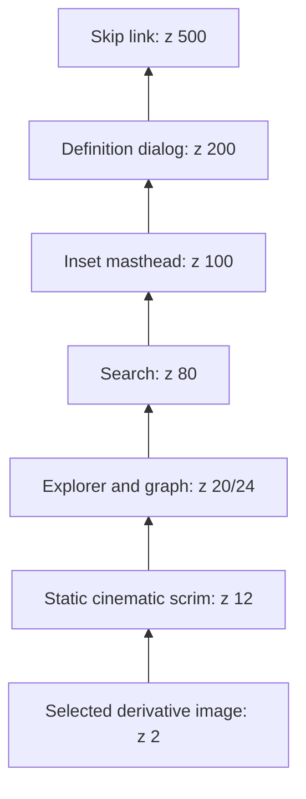

# Design Document: Animated Watch Image and Glass Header

## Overview

This feature replaces the mounted procedural `WatchMovementCanvas` with responsive presentation derivatives generated from the exact archival PNG at `source/assets/elite-watch-master.png`. The master is immutable, lossless source material outside `public`; browsers never receive it. A checked-in five-width AVIF primary source set and matching WebP fallback source set are generated without crop or upscale, integrity-recorded in `data/watch-image-asset.json`, and rendered through one decorative `<picture>` containing one ``.

One bounded CSS transform animates the entire selected image. Reduced-motion mode and an open definition dialog keep it static. No gear, jewel, hand, or other region is segmented or independently animated. The manifest retains master provenance for possible future 2.5D work, but this feature creates no depth map, layer slice, or per-part runtime representation.

The existing `.site-masthead` becomes an inset rounded smoke-glass bar while preserving landmarks, labels, destinations, order, responsive visibility, focus order, activation, search, graph relationships, dialog behavior, and application state. Static gradients, borders, highlights, and shadows replace live backdrop filtering. `components/canvas/WatchMovementCanvas.tsx`, integrity-protected watch CSS, and historical specs remain byte-for-byte unchanged.

## Task 1.1 Preflight Decision Record

The supplied master was inspected in place. The reported uppercase path `/Users/ankitkumar/Desktop/CODE/ACTIVITY/source/assets/elite-watch-master.png` and lowercase path resolve to the same device/inode on this case-insensitive macOS volume. The canonical spelling is the intended project-root path:

```text
/Users/ankitkumar/Desktop/CODE/activity/source/assets/elite-watch-master.png
project-relative: source/assets/elite-watch-master.png
```

The file was not moved, copied, rewritten, or re-encoded.

| Field | Observed value |
|---|---|
| SHA-256 | `7480bd94014cf1c5219f9abdcd0206b6848e2d353ede4e276d6e9a1001f8c66b` |
| Byte length | 9,381,741 bytes (8.947125 MiB) |
| Format/MIME | Genuine PNG / `image/png` |
| Magic signature | `89504e470d0a1a0a` |
| Dimensions | 2760×1504 |
| Decoded pixels | 4,151,040 |
| Aspect ratio | 345:188 (1.835106382979) |
| Storage model | 8-bit RGBA, noninterlaced |
| Nominal decoded RGBA | 16,604,160 bytes (15.834961 MiB) |
| Color metadata | Untagged RGB; no ICC, sRGB, gAMA, or cHRM chunk |
| Alpha | Channel present; min/max 255; zero nonopaque pixels |
| Other PNG metadata | No pHYs, tRNS, or palette chunk |
| Integrity/decode | All chunk CRCs valid; concatenated IDAT zlib stream, scanline lengths, PNG unfilter, native file identification, and native image decode passed |

Visual inspection of these exact hashed bytes passed. The frame contains a single close-up mechanical-watch movement. It contains no baked masthead, search field, MEN/WOMEN control, graph node or label, border, watermark, collage, or reference panel. Bright edge regions and watch-case details are part of the photograph, not a UI frame.

The previous 6 MiB rule applied to a proposed browser WebP and is intentionally retired. The 8.947125 MiB archival master is accepted by exact identity and decode health and is never transferred to browsers. Transfer limits apply to generated derivatives.

### Baseline health before production implementation

The untouched application baseline passed:

- `npm test`: 10 test files, 46 tests passed.
- `npm run typecheck`: exit 0.
- `npm run lint`: exit 0 with zero warnings.
- `npm run build`: exit 0; production build and static generation completed.
- `npm test -- tests/spec-integrity.test.ts`: 1 file, 1 integrity test passed.

No asset lifecycle hook exists at this preflight stage. Task 1.2 adds the derivative generator, verifier, and `predev`/`pretest`/`prebuild` gates. Production implementation remains blocked until Task 1.2 and the asset checkpoint pass.

## Goals and Non-Goals

### Goals

- Preserve the exact archival master outside `public` with hash-bound preflight evidence.
- Generate high-quality responsive AVIF and WebP browser assets from that master only.
- Block lifecycle entry points if source or derivative identity, format, dimensions, paths, or budgets are invalid.
- Keep browser-selected transfer at or below 1.5 MiB and decoded RGBA memory at or below 16,604,160 bytes.
- Animate one selected full-frame image with compositor-friendly transform only.
- Provide a completely static reduced-motion presentation.
- Preserve current header and explorer semantics, behavior, content, state, and responsive layout.
- Preserve future 2.5D provenance without implementing segmentation now.
- Preserve every Protected_Artifact byte-for-byte.

### Non-Goals

- Serving, moving, modifying, or imposing the retired 6 MiB browser limit on the archival master.
- Editing, deleting, replacing, or copying `WatchMovementCanvas.tsx`.
- Loading the master in runtime markup.
- Generating stock imagery, using remote assets, adding video, or drawing a production canvas.
- Segmenting the master, generating a depth map, or animating individual mechanisms.
- Renaming/reordering navigation or changing search, graph, dictionary, dialog, or state behavior.
- Adding pointer parallax or JavaScript-driven animation.
- Adding a package dependency; the existing dependency tree already provides the local image codec used by the later build task.

## Existing System Constraints

- `app/page.tsx` renders `EliteWatchesExperience` with `dictionaryTerms`.
- `EliteWatchesExperience` owns audience, selected definition, and focus-restoration state and currently mounts `WatchMovementCanvas`.
- Header order/destinations are COLLECTION (`#watch-atlas`), ABOUT (`/about`), ELITE WATCHES (`#watch-explorer`), CONTACT (`/contact`), LOGIN (`/login`).
- At widths at or below 700 CSS pixels, ABOUT and CONTACT are visually omitted without duplicating DOM.
- `NodeGraph` renders one decorative SVG and 13 native controls; focus has preview precedence over hover.
- `SearchBar` implements the existing combobox/listbox keyboard contract.
- `DefinitionPanel` traps focus, closes on Escape, and restores focus.
- `tests/helpers/integrity-manifest.ts` protects historical specs, canvas source, and watch CSS blocks.
- `scripts/atlas-visibility-smoke.mjs` enforces graph cardinality, hit-testing, finite interaction budgets, and runtime/network cleanliness.
- The current baseline is green, and `source/assets/elite-watch-master.png` exists with the approved identity.

## Architecture

```mermaid
graph TD
    A[Immutable archival PNG master outside public] --> B[build-watch-image-assets.mjs]
    A --> C[verify-watch-image-assets.mjs]
    B --> D[Five AVIF derivatives]
    B --> E[Five WebP derivatives]
    D --> C
    E --> C
    F[data/watch-image-asset.json] --> B
    F --> C
    C -->|pass| G[predev / pretest / prebuild]
    C -->|fail| H[non-zero blocking result]

    D --> I[WatchImageBackdrop picture]
    E --> I
    I --> J[One browser-selected image]
    J --> K[Whole-image CSS transform]

    L[EliteWatchesExperience] --> I
    L --> M[Existing semantic masthead]
    L --> N[Existing SearchBar]
    L --> O[Existing NodeGraph]
    L --> P[Existing DefinitionPanel]

    A -. provenance anchor for future 2.5D .-> Q[Future layer manifest, not this feature]
    R[WatchMovementCanvas.tsx] -. protected and unmounted .-> L
```

### Runtime layers



All decorative hero layers use `pointer-events: none`. Existing graph and masthead interaction planes remain authoritative.

## Components and Interfaces

The feature has two implementation boundaries: a local source/derivative pipeline that never serves the archival master, and one runtime `WatchImageBackdrop` boundary that supplies manifest-backed responsive markup to the unchanged experience. Their detailed interfaces and composition rules follow.

## Data Models

### Asset contract and manifest phases

`data/watch-image-asset.json` uses schema version 2. Task 1.1 records the approved source and a pending derivative policy:

```typescript
type ContractStatus =
  | "source-approved-derivatives-pending"
  | "ready";

interface MasterIdentity {
  readonly sourceFile: "source/assets/elite-watch-master.png";
  readonly publiclyServed: false;
  readonly mediaType: "image/png";
  readonly magicSignatureHex: "89504e470d0a1a0a";
  readonly sha256: string;
  readonly byteLength: number;
  readonly intrinsicWidth: 2760;
  readonly intrinsicHeight: 1504;
  readonly decodedPixelCount: 4151040;
  readonly decodedRgbaByteLength: 16604160;
  readonly aspectRatio: { readonly width: 345; readonly height: 188 };
  readonly bitDepth: 8;
  readonly colorType: "rgba";
  readonly interlaced: false;
}

interface DerivativeIdentity {
  readonly publicPath: `/assets/watch/elite-watch-${690 | 1035 | 1380 | 2070 | 2760}.${"avif" | "webp"}`;
  readonly file: `public${DerivativeIdentity["publicPath"]}`;
  readonly mediaType: "image/avif" | "image/webp";
  readonly sha256: string;
  readonly byteLength: number;
  readonly intrinsicWidth: 690 | 1035 | 1380 | 2070 | 2760;
  readonly intrinsicHeight: 376 | 564 | 752 | 1128 | 1504;
  readonly decodedPixelCount: number;
  readonly decodedRgbaByteLength: number;
  readonly encoder: Readonly<Record<string, string | number | boolean>>;
}
```

Unknown fields and partial ready-state manifests are rejected. While status is `source-approved-derivatives-pending`, production UI work is blocked. Task 1.2 generates all ten files, adds exact `DerivativeIdentity` entries, changes status to `ready`, and wires lifecycle verification.

### Derivative matrix

All dimensions are exact integer multiples of the reduced 345:188 master ratio. No crop or upscale is used.

| Width | Height | AVIF public path | WebP public path |
|---:|---:|---|---|
| 690 | 376 | `/assets/watch/elite-watch-690.avif` | `/assets/watch/elite-watch-690.webp` |
| 1035 | 564 | `/assets/watch/elite-watch-1035.avif` | `/assets/watch/elite-watch-1035.webp` |
| 1380 | 752 | `/assets/watch/elite-watch-1380.avif` | `/assets/watch/elite-watch-1380.webp` |
| 2070 | 1128 | `/assets/watch/elite-watch-2070.avif` | `/assets/watch/elite-watch-2070.webp` |
| 2760 | 1504 | `/assets/watch/elite-watch-2760.avif` | `/assets/watch/elite-watch-2760.webp` |

The intended local encoder contract is:

- decode only the hash-verified master;
- normalize derivative output to sRGB and RGB because every source alpha sample is 255;
- resize with fit-inside semantics, no enlargement, and no crop;
- AVIF: quality 72, effort 6, 4:4:4 chroma;
- WebP: quality 86, effort 6, smart subsampling;
- strip unrelated metadata from public derivatives;
- write only canonical output paths and never overwrite the master;
- compute metadata from finalized bytes and update the manifest explicitly in the generation task;
- perform no network request.

Generated files are checked in. Verification never regenerates or rewrites them.

### Budgets

| Budget | Limit | Scope |
|---|---:|---|
| AVIF transfer | 1,048,576 bytes | each AVIF candidate |
| WebP/selected transfer | 1,572,864 bytes | each WebP and any selected response |
| Aggregate derivative storage | 12,582,912 bytes | all ten public derivatives |
| Selected decoded pixels | 4,151,040 | one selected candidate |
| Selected decoded RGBA memory | 16,604,160 bytes | width × height × 4 |

The archival master is 9,381,741 bytes and is not a transfer candidate. It is fixed by SHA-256 rather than an arbitrary 6 MiB cap.

### Failure codes

```typescript
type AssetFailureCode =
  | "MASTER_MISSING"
  | "MANIFEST_MISSING"
  | "MANIFEST_INVALID"
  | "MASTER_FORMAT_INVALID"
  | "MASTER_IDENTITY_MISMATCH"
  | "MASTER_DECODE_INVALID"
  | "DERIVATIVE_SET_INCOMPLETE"
  | "DERIVATIVE_FORMAT_INVALID"
  | "DERIVATIVE_IDENTITY_MISMATCH"
  | "DERIVATIVE_DIMENSION_MISMATCH"
  | "ASSET_PATH_INVALID"
  | "ASSET_BUDGET_EXCEEDED";
```

The verifier validates local bytes only, uses deterministic first-failure ordering, performs zero writes/network access, and checks input hashes again after inspection to prove nonmutation.

## `WatchImageBackdrop`

**Planned file:** `components/ui/WatchImageBackdrop.tsx`

```typescript
interface WatchImageBackdropProps {
  readonly definitionOpen: boolean;
  readonly reducedMotion: boolean;
}

type WatchImageLoadState = "loading" | "ready" | "error";
```

Planned markup has one responsive tree:

```tsx
<picture className="watch-image-backdrop__picture">
  <source
    type="image/avif"
    srcSet={manifestBackedAvifSrcSet}
    sizes="100vw"
  />
  
</picture>
```

The fallback `src` is one member of WebP_Fallback_Set; it is not an extra visual tree. The browser selects one candidate. The master path is never emitted into markup.

Responsibilities:

- render one `<picture>` and one decorative ``;
- expose deterministic load/dialog/reduced-motion data attributes;
- reserve viewport layout before load;
- render no placeholder or alternate source on loading/error;
- expose “Watch image unavailable.” as an alert on runtime failure;
- add React state only for one-way load/error transition;
- add no pointer listener, timer, observer, interval, or animation-frame callback.

## Composition Migration

`EliteWatchesExperience` changes only the imported/mounted hero boundary:

```tsx
<WatchImageBackdrop
  definitionOpen={selectedTerm !== null}
  reducedMotion={Boolean(reduceMotion)}
/>
```

Existing state, callbacks, semantic header markup, link order, child props, and sibling order remain unchanged. `WatchMovementCanvas.tsx` is neither edited nor conditionally retained.

## Responsive Motion and Sizing

The wrapper clips one selected derivative and the `` owns one transform:

```css
.watch-image-backdrop {
  position: absolute;
  z-index: 2;
  inset: 0;
  overflow: hidden;
  pointer-events: none;
  background: #101416;
}

.watch-image-backdrop__picture,
.watch-image-backdrop__image {
  position: absolute;
  inset: 0;
  width: 100%;
  height: 100%;
  pointer-events: none;
}

.watch-image-backdrop__image {
  object-fit: cover;
  object-position: var(--watch-focal-x) var(--watch-focal-y);
  transform-origin: 50% 50%;
  animation: none;
}

.watch-image-backdrop[data-image-state="ready"][data-reduced-motion="false"][data-definition-open="false"]
  .watch-image-backdrop__image {
  animation: watch-image-drift 28s ease-in-out infinite;
  will-change: transform;
}

@keyframes watch-image-drift {
  0%, 100% { transform: translate3d(-1.25%, -0.5%, 0) scale(1.06); }
  50% { transform: translate3d(1.25%, 0.75%, 0) scale(1.10); }
}
```

`object-fit: cover` is invariant. Compact and expanded focal points both begin at 50% 50% but remain separate manifest fields. The 1.06 minimum scale creates a 3% per-edge guard, greater than maximum translation. Only transform animates. Definition-open mode pauses at the current frame with opacity 0.72. Reduced-motion mode has no animation or transition. Source selection remains native to `<picture>` and does not create React breakpoint state.

## Static Scrim and Glass Header

The existing `.cinematic-vignette` becomes one noninteractive static layer with at least 0.62 dark alpha behind the complete masthead, restrained radial edge protection, and a bottom readability gradient. It contains no image URL, filter, animation, or backdrop sampling.

The unchanged Site_Masthead markup receives:

| Geometry/material | Expanded (>700px) | Compact (≤700px) |
|---|---:|---:|
| Top inset | 12px | 8px |
| Inline inset | at least 16px | 8px |
| Height | 68px | 60px |
| Radius | 22px | 18px |
| Border | 1px light neutral | 1px light neutral |
| Background stops | smoke alpha 0.20 / 0.12 | same |
| Inset highlight | 1px, alpha 0.18 | same |
| Shadow | alpha ≤0.18, blur ≤28px | alpha ≤0.18, blur ≤24px |
| Link target | ≥44×44px | ≥44×44px |

No audited overlay declares either backdrop-filter spelling or animated filter/background-position/material effect. Reduced transparency/contrast uses a solid surface; forced colors uses system tokens. Header surface pointer events are disabled and restored only on existing links.

## Future 2.5D Compatibility

The full-frame master remains immutable and is the sole provenance anchor. The manifest records:

- exact master SHA-256;
- `segmentationApplied: false`;
- `derivativesArePresentationOnly: true`;
- `futureLayerManifestsMustReferenceMasterSha256: true`.

A future feature may add separately reviewed depth/layer metadata derived from the exact master, but must not reinterpret current responsive derivatives as editable source layers. This feature intentionally keeps one full-frame transform owner.

## Correctness Properties

### Property 1: Source-and-derivative gate soundness and nonmutation

For any bounded local manifest/source/derivative set and generated identity, path, format, membership, or budget mutation, the gate succeeds exactly for the complete valid contract, returns the deterministic failure class otherwise, and leaves every input byte unchanged.

**Validates: Requirements 1.8, 1.9, 1.10, 1.11, 1.12, 1.13, 1.14, 1.15**

### Property 2: Sole responsive hero-medium invariant

For any supported viewport, browser-format capability, load state, reduced-motion state, and dialog state, the experience has one `<picture>`, one ``, one manifest-approved selected derivative, no master URL, and no hero canvas/video/duplicate responsive tree.

**Validates: Requirements 2.1, 2.2, 2.3, 2.4, 2.5, 2.10, 9.2**

### Property 3: Responsive source, focal point, and cover-safe motion

For any viewport width 320–2560, candidate selection class, and progress across authored motion segments, the selected URL belongs to the correct manifest source set, uses the breakpoint focal point and cover sizing, remains in motion bounds, satisfies Cover_Guard, and has equal endpoints.

**Validates: Requirements 3.1, 3.2, 3.3, 3.4, 3.5, 3.6, 4.3, 4.4, 4.5, 4.6, 4.7**

### Property 4: Static mode and whole-image transform invariant

For any load, reduced-motion, and dialog state, ready reduced-motion states have zero animation and every presentation has at most one transform owner: the sole ``.

**Validates: Requirements 4.8, 4.11**

### Property 5: Static material source safety

For every masthead stop, Audited_Overlay block, and referenced animation, gradient alpha is at most 0.22 and forbidden backdrop/filter/background/material animations are absent.

**Validates: Requirements 6.1, 6.8, 6.9**

### Property 6: Graph and responsive-state preservation

For valid audience, selected-term, preview, reduced-motion, and width states, graph relationships/cardinality and application state remain equal to the existing model across 700/701 transitions and native image candidate changes.

**Validates: Requirements 7.5, 7.11, 9.11**

## Error Handling

| Scenario | Response | Recovery |
|---|---|---|
| Master absent/changed | Gate exits nonzero before generation/lifecycle | Restore exact approved bytes; never auto-update identity |
| Master malformed or undecodable | Gate blocks all production work | Obtain a clean approved source |
| Visual preflight fails | Task 1.1 fails | User supplies a clean watch-only master |
| Manifest malformed or pending | Gate exits nonzero | Complete reviewed derivative generation and metadata |
| Derivative missing/mismatched | Gate reports exact path/class and exits nonzero | Regenerate all derivatives from the unchanged master and explicitly review manifest update |
| Transfer/decode budget exceeded | Gate blocks | Adjust reviewed encoder settings/candidate plan; never alter master in place |
| Runtime selected-resource failure | Dark shell, error alert, controls remain usable | Repair checked-in public asset/deployment; no substitute request |
| Reduced motion | Same selected source, static cover | Automatic preference branch |
| Dialog opens | Current transform pauses; opacity becomes 0.72 | Resume when closed unless reduced motion remains active |
| CSS animation unsupported | Static cover | No JavaScript polyfill |

## Testing Strategy

### Source and derivative contract

- Unit tests cover missing master/manifest/derivatives, malformed PNG/AVIF/WebP, changed bytes, dimensions, paths, source-set membership, budget boundaries, pending status, and valid real assets.
- Property tests generate consistent contracts and one-field/one-byte mutations with at least 100 deterministic runs.
- Tests verify zero network calls and pre/post input hashes.
- Generation tests use synthetic non-hero fixtures; no fixture is a runtime fallback.

### Runtime and CSS

- Component tests cover one picture/img, exact source sets, semantics, load/error transitions, no master URL, no substitute request, and continued controls.
- Property tests cover source-set membership, one responsive tree, mode truth table, focal selection, motion bounds, and one transform owner.
- CSS/source tests cover static glass, forbidden effects, contrast/focus preference branches, and protected-selector exclusion.
- Existing preservation tests migrate only their mocked hero boundary.

### Browser validation

At 390×844 and 1024×576, the finite smoke validates:

- one picture/img and zero hero canvas/video;
- one successful selected derivative request and zero master request;
- HTTP MIME, byte length, and natural dimensions equal manifest metadata;
- AVIF selection when supported and valid WebP fallback markup;
- compact/expanded focal and cover geometry with no unpainted edge;
- selected transfer/decode budgets;
- no audited computed backdrop filter;
- reduced-motion stasis and correct layer/hit-testing order;
- three warmed interaction samples under existing 100 ms thresholds;
- 120 raw frame intervals, at least 95% ≤25 ms and all ≤100 ms;
- zero runtime/console/hydration/network failures and finite cleanup.

## Migration Plan

1. Preflight the exact master in place, record evidence, run baseline checks, and reconcile specs. **Task 1.1 scope; completed evidence is recorded but task status remains orchestrator-owned.**
2. Generate all ten responsive derivatives, record exact identities, implement the blocking verifier, and wire lifecycle hooks.
3. Pass asset tests and checkpoint; no production UI work starts before this point.
4. Add `WatchImageBackdrop` with one `<picture>`/`` tree and isolated tests.
5. Replace only the canvas import/mount in `EliteWatchesExperience`.
6. Add non-protected hero/scrim/header/overlay styles.
7. Migrate preservation and browser-smoke expectations.
8. Run complete finite validation and unchanged integrity checks.

## File Change Map

| Path | Planned action |
|---|---|
| `source/assets/elite-watch-master.png` | Existing immutable user source; never edit/move/serve |
| `data/watch-image-asset.json` | Record source preflight now; add exact derivative identities in Task 1.2 |
| `public/assets/watch/elite-watch-{690,1035,1380,2070,2760}.avif` | Generate/check in during Task 1.2 |
| `public/assets/watch/elite-watch-{690,1035,1380,2070,2760}.webp` | Generate/check in during Task 1.2 |
| `scripts/build-watch-image-assets.mjs` | Add deterministic local generator in Task 1.2 |
| `scripts/verify-watch-image-assets.mjs` | Add finite local verifier in Task 1.2 |
| `package.json` | Add generation/verification scripts and lifecycle gates in Task 1.2 |
| `components/ui/WatchImageBackdrop.tsx` | Add responsive picture component later |
| `components/EliteWatchesExperience.tsx` | Replace only canvas import/mount later |
| `app/globals.css` | Add image/static-glass styles outside protected blocks later |
| tests and smoke files named in tasks | Add/update incrementally |
| `components/canvas/WatchMovementCanvas.tsx` | **No change** |
| protected watch CSS blocks | **No change** |
| `.kiro/specs/ai-coding-dictionary-inspired-site/**` | **No change** |

## Dependencies

No package is added. The implementation uses current React/TypeScript/Framer Motion, Node filesystem/crypto facilities, Vitest, Testing Library, fast-check, the existing local browser harness, and the image codec already present in the installed dependency tree. Generation and verification are local and finite; no network access is permitted.
