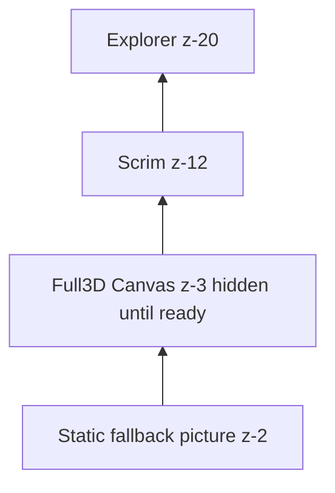

# Design Document: Full 3D Watch

## Overview

Full 3D replaces the `LayeredWatchEnhancement` `watch-layer-enhancement` `z-3` composition with a `Full3DWatchCanvas` `z-3` WebGL `Canvas` `three@0.185.1` `@react-three/fiber@9.7.0` `@react-three/drei@10.7.8` while keeping `WatchImageBackdrop` `picture` `z-2` as `Static_Fallback_Surface`. The `WatchMovementCanvas.tsx:1` preserved procedural canvas is the baseline for `Full3DWatchCanvas` but with measured `upper-right-wheel` geometry, `MeshPhysicalMaterial` `PBR`, and `Animation_Clock` `sampleMotion` parity.

## Architecture

`Full3DWatchCanvas` is `aria-hidden` `pointer-events:none` `tabIndex=-1` decorative, `useAnimationClock` `Active_Elapsed_Time` drives `upper-right-wheel` `continuous-rotation` `period 2000` `pivot 1925,355` via `createPivotCenteredRotationMatrix`.

## Components

- `components/canvas/Full3DWatchCanvas.tsx` — `Canvas` `dpr [1,1.6]` `frameloop demand|always` `ACECFilmicToneMapping` `SRGBColorSpace`, `Full3DMovementScene` with `upper-right-wheel` `Gear` `MeshPhysicalMaterial`, `CameraChoreography` `lerp` `definitionOpen`.
- `lib/full-3d/types.ts` — `Full3DAssetPackage` `Full3DMigrationGate` types.
- `scripts/verify-full-3d-assets.mjs` — checks `source/assets/full-3d/` `public/assets/full-3d/` `data/full-3d-release.json`.

## Correctness Properties

- **Property 1: Motion parity** — `sampleMotion` `upper-right-wheel` `2000ms` `1` `authored-assumption` deterministic `Active_Elapsed_Time`.
- **Property 2: Fallback atomic** — `Full3D` `Enhanced_Error_State` `Unsupported` `0` `public` requests, `Static_Fallback_Surface` visible.

## File Map

| Path | Action |
|---|---|
| `components/canvas/Full3DWatchCanvas.tsx` | Create from `WatchMovementCanvas.tsx` with measured wheel |
| `lib/full-3d/types.ts` | Create |
| `scripts/verify-full-3d-assets.mjs` | Create |
| `data/full-3d-release.json` | Create `fallback-only` |
| `public/assets/full-3d/` | Generated on demand |
| `components/ui/WatchImageBackdrop.tsx` | Add `Full3DWatchCanvas` sibling, keep `LayeredWatchEnhancement` as secondary fallback |
