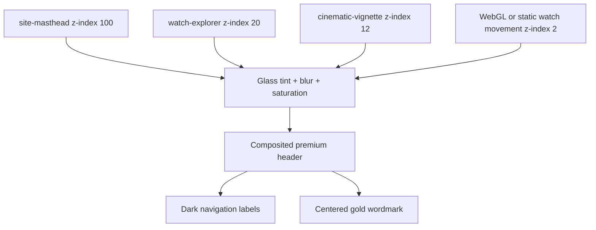
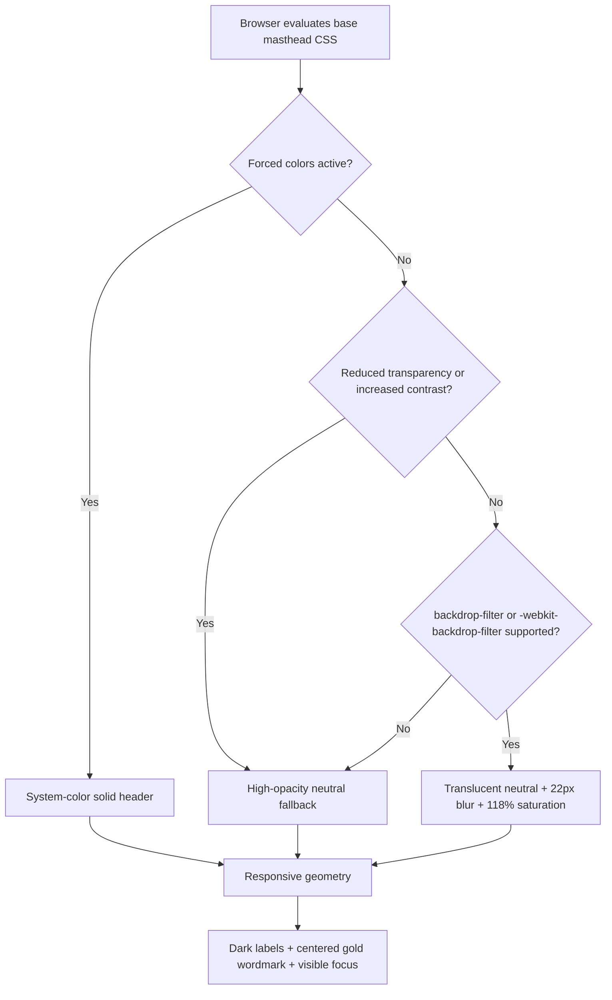
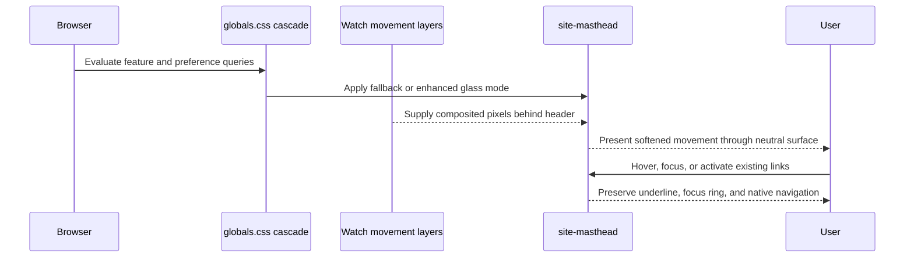

# Design Document: Premium Frosted-Glass Header

## Overview

The `glass-header` feature refines the existing ELITE WATCHES top navigation into a premium frosted-glass surface that allows the animated or static watch movement to remain perceptible behind the masthead while preserving crisp navigation, a centered burnished-gold wordmark, and WCAG-aligned readability. The change is intentionally presentation-only: the semantic `<header>`, two existing `<nav>` landmarks, link destinations, centered home link, canvas/static movement implementation, and application state remain unchanged.

The implementation will use an opaque-enough neutral fallback as the base style and progressively enable lower-alpha translucency with backdrop blur and restrained saturation when either standard or WebKit-prefixed `backdrop-filter` is supported. Responsive rules retain the established 68 px desktop and 60 px compact masthead geometry, while accessibility modes can replace transparency with a more opaque surface and system colors.

### Goals

- Reveal subdued watch-movement tone and motion through the header without allowing background detail to compete with navigation.
- Create a luxury-material impression through one neutral glass tint, controlled blur/saturation, a fine light divider, a one-pixel inset highlight, and a low-opacity shadow.
- Keep navigation labels dark, the centered ELITE WATCHES wordmark recognizably gold, and both at a minimum 4.5:1 contrast against the final composited surface.
- Preserve current semantic markup, destinations, stacking order, focus behavior, and responsive information hierarchy.
- Provide deterministic fallbacks for unsupported backdrop filtering, reduced-transparency preferences, forced colors, WebGL failure, and the existing static movement fallback.
- Add no production dependency, JavaScript state, animation loop, or continuously changing header effect.

### Non-Goals

- Redesigning navigation content, adding a mobile menu, making the header sticky, or changing any link destination.
- Changing the watch movement, atlas graph, search, definition panel, page metadata, or application state.
- Reproducing a third-party logo, exact material shader, layout, asset, or source code from the luxury-watch reference.
- Introducing runtime feature detection in React; CSS feature and media queries are sufficient.
- Modifying the historical `ai-coding-dictionary-inspired-site` specification.

## Existing Architecture and Constraints

### Current Integration Points

| Existing file or layer | Current role | Design consequence |
|---|---|---|
| `components/EliteWatchesExperience.tsx` | Renders `.site-masthead`, left and right navigation landmarks, and the centered `.wordmark` before the explorer content | No component prop, state, event, or markup change is required for the glass treatment |
| `app/globals.css` | Owns all masthead geometry, color, blur, shadow, link, wordmark, hover, focus-adjacent, and compact-width rules | The implementation is localized to existing masthead selectors plus feature/media-query overrides |
| `components/canvas/WatchMovementCanvas.tsx` | Renders the WebGL movement or `.watch-static-fallback` inside `.watch-canvas-shell` | Both movement modes already occupy the area behind the masthead and must remain visible through enhanced glass |
| `components/ui/NodeGraph.tsx` | Renders explorer controls and SVG rays above the canvas | Header z-index must remain above explorer controls without changing graph hit testing |
| `app/layout.tsx` | Defines dark page color scheme and global stylesheet import | No metadata, viewport, or stylesheet import change is required |
| `tests/accessibility.test.tsx` and Vitest setup | Exercise semantic and keyboard behavior in JSDOM | Existing tests remain valid; new style-contract tests can use the same finite `vitest run` command |

### Existing Paint Planes

The current stack places the watch canvas at z-index 2, the cinematic vignette at 12, the explorer at 20, and the masthead at 100. `backdrop-filter` samples the pixels painted behind the masthead, so the current structure already supports a real frosted effect without moving or cloning the watch layer.



The masthead remains an overlay at the top of `.elite-shell`; it does not enter document flow and does not become sticky. Search placement already accounts for the 68 px desktop and 60 px compact header heights.

## Architecture

### Progressive-Enhancement Cascade

The CSS cascade resolves the surface in this order:

1. Define a high-opacity warm-neutral fallback directly on `.site-masthead`.
2. Add divider, inset highlight, restrained shadow, and dark foreground colors independently of blur support.
3. Inside an `@supports` query accepting standard or `-webkit-` backdrop filtering, lower the neutral surface alpha and apply blur plus saturation.
4. In reduced-transparency or increased-contrast modes, restore the high-opacity surface and remove backdrop filtering.
5. In forced-colors mode, use system colors and a system border instead of authored glass colors.
6. Apply the existing compact layout after the base material rules so only geometry and typography change; material behavior remains equivalent.



### Style Resolution Sequence



## Components and Interfaces

### Semantic Header Component

**Owner:** `components/EliteWatchesExperience.tsx`

**Contract:**

```tsx
<header className="site-masthead">
  <nav className="masthead-nav masthead-nav--left" aria-label="Primary navigation">
    {/* existing COLLECTION and ABOUT links */}
  </nav>
  <a className="wordmark" aria-label="ELITE WATCHES home">ELITE WATCHES</a>
  <nav className="masthead-nav masthead-nav--right" aria-label="Account navigation">
    {/* existing CONTACT and LOGIN links */}
  </nav>
</header>
```

The structure above is descriptive of the existing contract, not a requested markup rewrite. The glass feature must not add wrappers, pseudo-interactive layers, duplicated labels, or event handlers.

**Responsibilities:**

- Continue exposing one header landmark and two named navigation landmarks.
- Keep current links and the centered home link operable with pointer, touch, and keyboard.
- Remain above all visual and interactive explorer layers.

### Glass Surface

**Owner:** `.site-masthead` in `app/globals.css`

**Responsibilities:**

- Establish fallback and enhanced material modes.
- Keep the masthead at the existing dimensions and paint order.
- Bound visual effects to the 68 px or 60 px strip.
- Supply a stable light-enough composited surface for dark foreground text.

**CSS contract:**

```css
:root {
  --header-glass-fallback: rgba(245, 243, 238, 0.95);
  --header-glass-enhanced: rgba(244, 242, 236, 0.68);
  --header-glass-border: rgba(255, 255, 255, 0.44);
  --header-glass-highlight: rgba(255, 255, 255, 0.58);
  --header-glass-shadow: rgba(0, 0, 0, 0.11);
  --header-label: #252a2b;
  --header-gold: #563407;
  --header-blur: 22px;
  --header-saturation: 118%;
}
```

The values are design targets. During implementation, a value may move only within the bounded ranges below to satisfy measured contrast across WebGL and static backgrounds:

- enhanced tint alpha: `0.64` through `0.72`;
- blur: `18px` through `24px`;
- saturation: `110%` through `125%`;
- divider alpha: `0.30` through `0.55`;
- exterior shadow alpha: no more than `0.14`;
- exterior shadow blur: `18px` through `30px`;
- inset highlight: one CSS pixel with alpha no more than `0.65`.

### Navigation Labels

**Owners:** `.masthead-nav a` and `.masthead-nav a::after`

**Responsibilities:**

- Use opaque dark-charcoal text rather than translucent gray.
- Preserve current uppercase labels, tracking, underline interaction, and 44 px minimum target size.
- Keep hover and focus feedback independent of color alone through the existing underline plus global focus outline.
- Avoid text shadow that could blur small labels.

### Centered Brand

**Owner:** `.wordmark`

**Responsibilities:**

- Remain geometrically centered in the viewport rather than centered between unequal navigation groups.
- Use an opaque dark burnished-gold color that reaches 4.5:1 contrast against the darkest accepted enhanced composite.
- Retain the serif identity and restrained highlight, but avoid glow or metallic gradients that reduce glyph-edge clarity.
- Scale and tighten tracking at compact widths without colliding with visible side links.

### Compatibility Layer

**Owners:** CSS `@supports` and accessibility media queries in `app/globals.css`

**Responsibilities:**

- Recognize both standard and WebKit-prefixed backdrop-filter support.
- Keep the base surface readable without filter support.
- Honor reduced-transparency and increased-contrast preferences when supported.
- Replace authored colors with system colors under forced-colors mode.

## Data Models

This feature introduces no runtime data model. Its stable configuration is a set of CSS material tokens and environmental inputs.

```typescript
interface GlassHeaderEnvironment {
  readonly viewportWidth: number;
  readonly backdropFilterSupported: boolean;
  readonly webkitBackdropFilterSupported: boolean;
  readonly reducedTransparency: boolean;
  readonly increasedContrast: boolean;
  readonly forcedColors: boolean;
}

type GlassHeaderMode = "enhanced" | "opaque-fallback" | "forced-colors";

interface GlassHeaderGeometry {
  readonly heightPx: 68 | 60;
  readonly minimumTargetPx: 44;
  readonly fullViewportWidth: true;
  readonly topOffsetPx: 0;
}
```

These interfaces document the test oracle only; the production implementation remains CSS-driven and does not add a TypeScript resolver.

### Mode Invariants

- `forcedColors` selects `forced-colors` regardless of other inputs.
- Reduced transparency or increased contrast selects `opaque-fallback` when forced colors are inactive.
- Standard or prefixed filter support selects `enhanced` only when no overriding accessibility preference is active.
- Absence of both filter implementations selects `opaque-fallback`.
- Widths through 700 px use 60 px geometry; larger widths use 68 px geometry, matching the existing breakpoint.

## Visual Material Specification

### Background Transmission

The enhanced header uses a warm ivory-neutral overlay near 68% opacity. This is translucent enough for large changes in the watch movement—dark plates, silver gears, rose-gold bridges, and the static fallback—to remain perceptible, while the 22 px blur suppresses high-frequency detail behind small labels. Saturation near 118% retains the rose-gold/ruby character of the movement without producing a colored cast across the entire header.

The header must not add a second opaque gradient layer. The premium finish comes from the composited backdrop, neutral tint, and bounded edge treatments rather than stacked decorative overlays.

### Border, Highlight, and Shadow

- One light bottom divider separates the glass from the cinematic content.
- One inset top highlight suggests a polished glass edge.
- One low-opacity exterior shadow separates the header from bright watch parts.
- No shadow extends far enough or dark enough to resemble a floating card.
- No animated shimmer, noise texture, specular sweep, or pulsing glow is introduced.

### Foreground Palette

- Navigation labels: `#252a2b` target, fully opaque.
- Wordmark: `#563407` target, fully opaque, perceived as dark antique gold against the ivory glass.
- Interactive underline: may retain a warmer gold accent when the underline itself reaches the 3:1 non-text contrast target or is supplemented by the global focus indicator.
- Focus indicator: retain the existing high-visibility global outline and ensure the header does not clip it.

## Responsive Behavior

### Expanded Layout: Above 700 px

- Preserve 68 px height and current fluid horizontal padding.
- Preserve both two-link navigation groups.
- Keep the wordmark absolutely centered at 50% of the viewport.
- Keep blur, tint, divider, highlight, and shadow values identical to compact mode.

### Compact Layout: 700 px and Below

- Preserve 60 px height.
- Continue hiding ABOUT and CONTACT under the existing selectors; COLLECTION and LOGIN remain visible.
- Keep each visible link at least 44 by 44 CSS pixels, including widths at or below 390 px.
- Reduce wordmark size/tracking only as needed to avoid overlap; do not truncate, wrap, or shift the brand off center.
- Use safe inline padding that does not create horizontal overflow on a 320 px viewport.
- Preserve the existing search offset below the header and do not obscure explorer controls.

### Zoom and Orientation

At 200% browser zoom and after portrait/landscape changes, the same responsive CSS breakpoint owns geometry. No JavaScript state is reconstructed, so the selected audience, selected term, search state, canvas state, and definition panel state remain unaffected.

## Accessibility

- Navigation labels and the gold wordmark must each maintain at least 4.5:1 contrast against the darkest accepted final composite in enhanced mode and against the fallback surface.
- Header divider, focus indicator, and meaningful hover/focus boundaries must reach at least 3:1 contrast against adjacent colors.
- Every visible navigation target remains at least 44 by 44 CSS pixels.
- Existing landmark names, accessible link names, focus order, skip link, and focus-visible outline remain unchanged.
- Transparency is decorative. Reduced-transparency and increased-contrast modes use the opaque fallback without losing content or state.
- Forced-colors mode uses system foreground/background/border colors and allows the user agent to render focus indication.
- The feature introduces no motion, so reduced-motion behavior remains unchanged.
- The header surface and any decorative paint remain noninteractive; pointer events continue reaching only the existing links.

## Error Handling and Compatibility

| Scenario | Response | Recovery/verification |
|---|---|---|
| Standard `backdrop-filter` unsupported | Keep 95% opaque neutral fallback, divider, highlight, shadow, and foreground colors | Links and wordmark remain readable; no script or reload is required |
| Only `-webkit-backdrop-filter` supported | Activate enhanced glass through the prefixed feature-query branch | Safari receives the same target blur and saturation |
| Reduced transparency requested | Disable filter and restore high-opacity neutral surface | Content and layout remain identical |
| Increased contrast requested | Prefer high-opacity surface, stronger divider, and unchanged opaque text | Contrast test verifies labels and brand |
| Forced colors active | Use system canvas/text/link/border colors and suppress authored shadow if the user agent requires | Keyboard focus and all links remain visible |
| WebGL unavailable or throws | Existing static movement fallback remains the backdrop | Enhanced glass softens the static gears in the same way |
| CSS filter is expensive on a device | Effect remains limited to one shallow fixed-size masthead with no animation or `will-change` | Browser may use fallback if support is absent; no correctness depends on blur |
| A future background lowers contrast | Increase neutral tint opacity within the approved range or select the opaque fallback | Contrast gate blocks release below 4.5:1 |

## Correctness Properties

### Property-Based Testing Decision

No property-based correctness properties apply to this feature. Acceptance-criteria prework classified all 71 criteria as finite examples, edge cases, integration checks, or smoke checks. The feature contains declarative CSS compositing, fixed semantic DOM, repository-scope guards, and external browser rendering; it does not introduce a pure project-owned transformation for which 100 generated inputs would provide meaningful additional confidence.

Property reflection found no candidate properties to combine or remove. Creating randomized tests for viewport rendering, browser feature support, backdrop compositing, or accessibility modes would primarily retest browser engines at high cost and would conflict with the project rule against property-based testing for UI rendering and layout.

### Non-Property Correctness Coverage

- **Structural and smoke checks:** Requirements 1.1–1.5, 1.10; Requirements 2.2–2.4, 2.6–2.8, 2.10; Requirements 3.1–3.2, 3.10; Requirement 4.2; Requirements 6.5, 6.9; and Requirements 7.1–7.6.
- **Example-based interaction checks:** Requirement 1.8; Requirements 3.6–3.8; Requirements 5.2, 5.4–5.5; and Requirements 6.1–6.2, 6.4, 6.7.
- **Browser integration checks:** Requirements 1.6–1.7, 1.9; Requirements 2.1, 2.5, 2.9; Requirements 3.3–3.5, 3.9; Requirements 4.1, 4.3–4.10; Requirements 5.1, 5.3, 5.6–5.10, 5.12; Requirements 6.3, 6.6, 6.8, 6.10; and Requirements 7.7–7.9.
- **Explicit edge-case check:** Requirement 5.11.

Because there are no property statements, no `Property N` annotation or property-based test task is required. Every requirement remains traceable to an executable non-PBT test category above.

## Testing Strategy

### Unit and Structural Tests

Use the existing Vitest/JSDOM setup to verify:

- the header, both named navigation landmarks, current link labels/destinations, and centered home link remain present;
- no new interactive wrapper or duplicated link is introduced;
- stylesheet source contains the fallback declaration before the enhanced `@supports` rule;
- both standard and WebKit-prefixed properties are declared;
- compact rules preserve 44 px minimum targets;
- forced-colors and transparency/contrast preference branches retain a readable surface.

Static contrast tests can parse the approved opaque foreground and fallback tokens and calculate WCAG contrast. Enhanced-mode browser tests must verify the final composited result because source-token contrast alone cannot account for backdrop pixels.

### Browser Integration and Visual Regression

Use finite, non-watch browser checks at representative widths:

- 320 px compact layout with static movement fallback;
- 390 px compact overlap and target-size boundary;
- 700 px compact breakpoint;
- 701 px expanded breakpoint;
- 1440 px desktop WebGL presentation;
- 1280 px window at 200% zoom;
- unsupported-filter emulation or forced fallback class in the test harness;
- forced-colors and reduced-transparency emulation when supported by the harness.

For each visual state, verify full-width coverage, no clipping or overlap, centered brand geometry, visible movement transmission in enhanced mode, opaque readability in fallback mode, and stable header height. Pixel or computed-color sampling must establish at least 4.5:1 text contrast and 3:1 focus/boundary contrast.

### Accessibility Tests

- Tab through all header links in both expanded and compact layouts.
- Assert DOM source order and accessible names are unchanged.
- Assert every visible target's bounding box is at least 44 by 44 CSS pixels.
- Assert focus outlines are not clipped by masthead overflow or neighboring layers.
- Run automated accessibility checks in default, fallback, high-contrast, and definition-panel-open states.

### Regression Validation

Run finite project checks after implementation:

```text
npm test
npm run typecheck
npm run lint
npm run build
```

No development server, watch mode, or implementation execution belongs to this specification workflow.

## Performance Considerations

- Apply backdrop filtering to one 60–68 px-high element only.
- Do not animate blur, saturation, opacity, shadow, or background color.
- Do not use `will-change`, canvas copies, duplicated backdrop layers, SVG filters, or JavaScript sampling.
- Keep shadow and blur radii bounded as specified to limit offscreen paint expansion.
- Preserve the current canvas render strategy; the glass feature adds no animation frame or React render.
- Confirm scrolling and existing movement remain visually smooth in the supported browser matrix, but preserve readability through fallback even if a browser declines the filter.

## Security Considerations

The feature introduces no data input, network request, HTML injection point, permission, cookie, storage, authentication behavior, or production dependency. Existing links and component behavior remain unchanged. CSS feature queries cannot expose project data; no runtime browser-capability result is persisted.

## Dependencies

### Runtime

No new runtime dependency. Existing Next.js, React, Three.js, React Three Fiber, Drei, and Framer Motion behavior is unchanged.

### Development and Testing

The existing TypeScript, Vitest, Testing Library, ESLint, and Next.js build toolchain remains the baseline. If a browser screenshot harness is added during implementation, it must be a development-only exact-version dependency with lockfile coverage and finite non-watch commands.

## Implementation Boundary

Expected application changes are limited to masthead-related declarations and compatibility/media-query branches in `app/globals.css`. `components/EliteWatchesExperience.tsx` should change only if an automated semantic regression test exposes a pre-existing accessibility defect that cannot be corrected in CSS; such a change requires returning to this design. No file under `.kiro/specs/ai-coding-dictionary-inspired-site/` is an implementation target.
