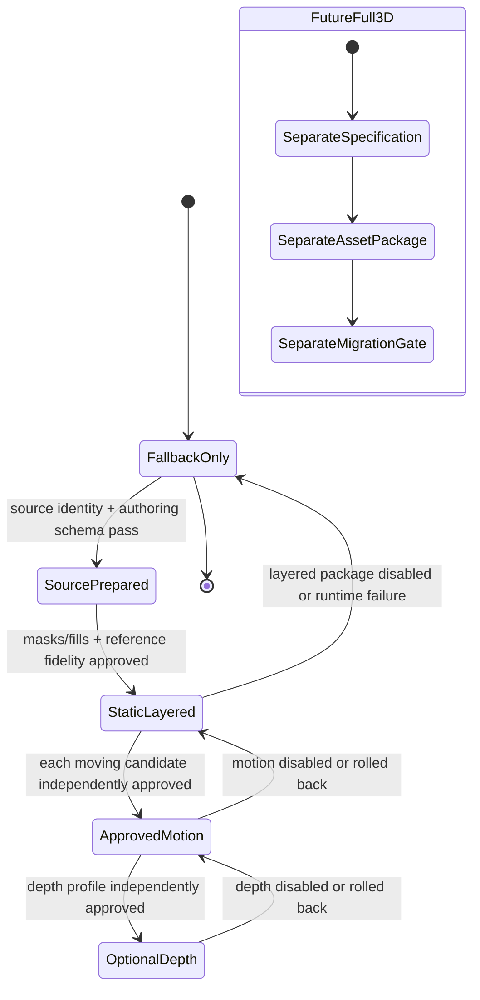
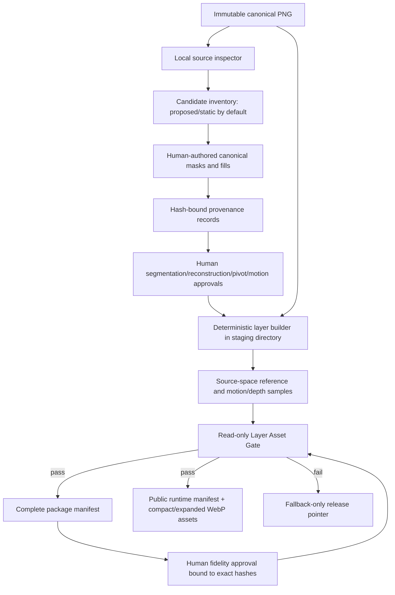
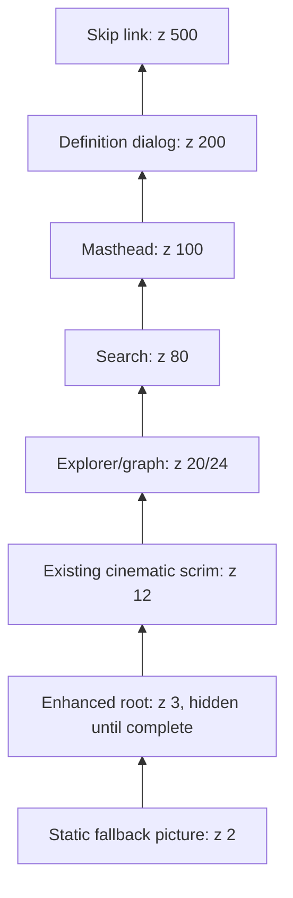
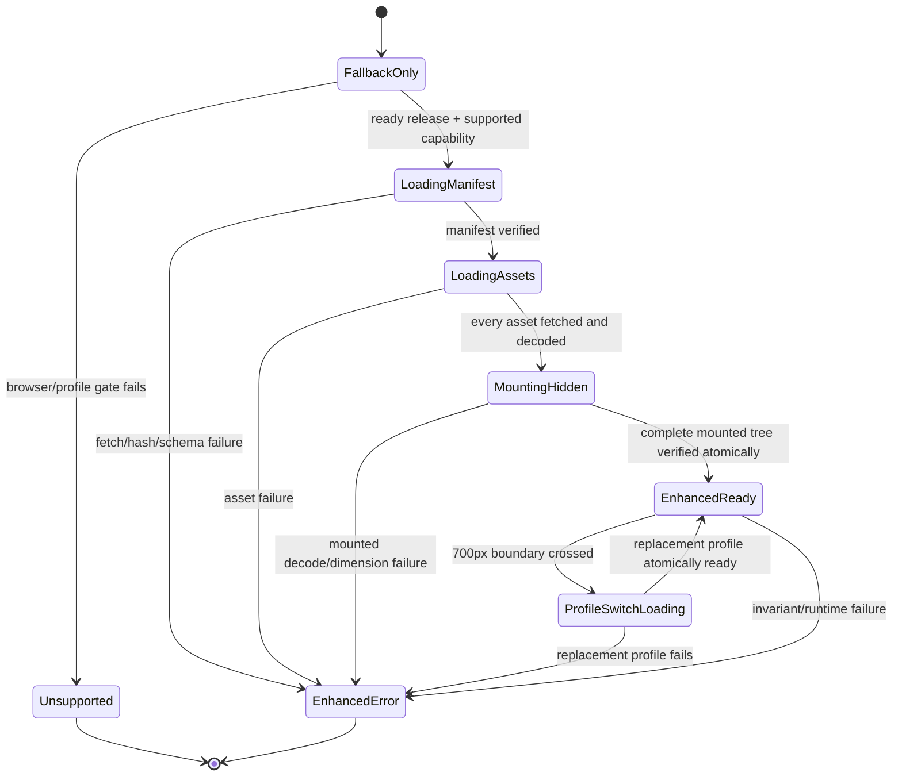

# Design Document: Interactive Layered Watch 2.5D

## Overview

This design extends the completed `animated-watch-image-glass-header` presentation with a separately versioned, locally authored 2.5D layer package. The existing `WatchImageBackdrop` responsive `<picture>` remains the authoritative `Static_Fallback_Surface`, retains the approved 28-second whole-image drift, and remains available throughout loading, failure, reduced-motion, unsupported-browser, and rollback paths. The successor never modifies the canonical PNG, predecessor derivatives, predecessor manifest facts, protected canvas, protected CSS blocks, dependency fields, or predecessor specification.

The implementation is deliberately phased and reversible:

1. establish hash-bound source evidence and a fallback-only release;
2. identify possible visible parts without approving motion;
3. author and review masks plus reconstructed backgrounds in canonical source coordinates;
4. prove a static layered `Reference_Pose` against the source and predecessor screenshots;
5. enable only individually approved moving parts;
6. optionally enable restrained, time-driven depth only after all earlier gates pass;
7. leave true modeled 3D to a separate future specification and asset package.

The source photograph is not a mechanical drawing. It records visible color and opacity, not hidden pixels, dimensions, pivots, tooth counts, depth, or kinematic truth. Every mask, pivot, fill, depth value, and motion relationship is therefore an authored interpretation. Generated metadata and user-facing diagnostics use that terminology and never describe inferred data as recovered or measured source truth.

### Approved defaults resolved by this design

- The first release is layered 2.5D, not WebGL or modeled 3D.
- The predecessor remains visible until an enhanced profile is complete and atomically ready.
- Motion is a deterministic demonstration timeline, not wall-clock watch time.
- Optional depth is disabled by default, has no user-facing control, and is driven only by the animation clock if later approved.
- The decorative watch accepts no pointer, touch, wheel, keyboard, camera, microphone, or orientation input.
- Unreviewed or ambiguous regions are static. An empty approved-moving-part list is a valid fallback/reference-only release.
- Compact runtime assets are generated at 1380×752; expanded assets are generated at 2760×1504. Both retain canonical 2760×1504 coordinates in metadata.
- A runtime profile contains one manifest request plus at most seven image requests, keeping the complete successor request count at or below eight.
- Public successor imagery uses locally generated WebP with alpha quality 100, smart subsampling, recorded deterministic encoder settings, and no runtime package dependency. Decode failure falls back; no alternate successor format is requested.
- Existing `fast-check`, Vitest, the local Chromium/CDP harness, Node APIs, and the lock-resolved `sharp` codec are reused. `dependencies` and `devDependencies` remain byte-for-byte unchanged.

## Local Research Findings

Design research was performed against the approved requirements, canonical source, and current implementation rather than against a hypothetical project:

- `source/assets/elite-watch-master.png` is the approved 2760×1504 opaque PNG with SHA-256 `7480bd94014cf1c5219f9abdcd0206b6848e2d353ede4e276d6e9a1001f8c66b`. Visual inspection shows exposed and partially occluded wheel-, gear-, spring-, bridge-, and oscillator-like regions. No central or subdial hands are visible. No visible part is approved merely by this inspection.
- `data/watch-image-asset.json` is schema version 2 and records the immutable master plus ten checked-in AVIF/WebP derivatives. Its `segmentationApplied: false` value remains predecessor metadata and is not rewritten.
- `components/ui/WatchImageBackdrop.tsx` owns one decorative `<picture>`/`` fallback and deterministic `loading | ready | error` state. `components/EliteWatchesExperience.tsx` supplies only dialog-open and reduced-motion state, so the successor can remain isolated behind the same public component boundary.
- `app/globals.css` gives the fallback `object-fit: cover`, centered focal points, z-index 2, the approved 28-second transform, reduced-motion stasis, and dialog opacity/pause behavior. The source-to-viewport mapper must reproduce these values rather than introduce a second framing model.
- `scripts/build-watch-image-assets.mjs` and `scripts/verify-watch-image-assets.mjs` already establish safe-path checks, deterministic first failures, single-threaded deterministic encoding, pre/post input hashes, zero-network local processing, and lifecycle verification. Successor tools follow the same split: a writing builder and a read-only verifier.
- `scripts/atlas-visibility-smoke.mjs` already captures request identity, runtime/console/hydration errors, 120 frame intervals, long tasks, interaction response, layer geometry, and hit testing. It is extended rather than replaced.
- `tests/helpers/integrity-manifest.ts` currently protects the original historical spec, `WatchMovementCanvas.tsx`, and watch-specific CSS blocks. The successor extends the protected file set to include every file under `.kiro/specs/animated-watch-image-glass-header/` while retaining all existing assertions.
- The project uses Next 16.3.3, React 19.2.8, TypeScript 5.9.3, Vitest 4.1.11, fast-check 4.9.0, and lock-resolved `sharp` 0.35.4. No dependency change is needed.

Relevant browser primitives are standard in the approved matrix: [`HTMLImageElement.decode()`](https://developer.mozilla.org/docs/Web/API/HTMLImageElement/decode), [`requestAnimationFrame`](https://developer.mozilla.org/docs/Web/API/Window/requestAnimationFrame), the [Page Visibility API](https://developer.mozilla.org/docs/Web/API/Page_Visibility_API), [`ResizeObserver`](https://developer.mozilla.org/docs/Web/API/ResizeObserver), and [`SubtleCrypto.digest()`](https://developer.mozilla.org/docs/Web/API/SubtleCrypto/digest). Runtime support is nevertheless checked conservatively before any successor request.

## Goals and Non-Goals

### Goals

- Preserve the completed predecessor as immutable source, fallback, interaction, and integrity baseline.
- Build a finite local authoring and verification path for masks, synthetic fills, pivots, motion, depth, provenance, approvals, and release assets.
- Make human visual approval explicit and hash-bound while automating objective identity, geometry, coverage, fidelity, budget, and behavior checks.
- Use one canonical coordinate system from source authoring through runtime transforms.
- Activate a complete enhancement atomically and roll back atomically to the existing fallback on any failure.
- Derive every transform from manifest version, active elapsed time, viewport mapping, and application state.
- Preserve accessibility, UI behavior, focus, hit testing, responsive state, and performance budgets.
- Produce artifacts and semantic IDs that a future separately specified 3D package can reference without conflating 2.5D with geometry.

### Non-Goals

- Recovering hidden pixels, geometry, dimensions, materials, pivots, or mechanisms from one flat image.
- Automatically deciding that a visible region is a credible moving part.
- Automatically approving a mask, fill, pivot, kinematic relationship, motion profile, depth profile, or fidelity review.
- Serving the canonical master, modifying predecessor derivatives, or changing predecessor provenance.
- Adding WebGL, a production canvas, Three.js rendering, Blender assets, pointer parallax, gyroscope input, or direct manipulation.
- Claiming mechanically calibrated time or authentic tooth-count relationships without separately recorded evidence.
- Adding dependencies or changing existing dependency versions.
- Implementing the feature in this design phase.

## Architecture

### Delivery phases and gates



Each phase record contains an explicit status and exact manifest/asset hashes. A later phase can be released only when every earlier phase is approved. `fallback-only` is a valid, safe release status and causes zero successor runtime requests. `future-full-3d` is represented only as an unavailable handoff target; this feature cannot activate it.

### Offline authoring and build flow



The pipeline has four trust boundaries:

1. **Immutable input boundary:** the canonical master and predecessor contract are read-only and hash-checked before and after every operation.
2. **Authored-data boundary:** candidate declarations, masks, fills, pivots, and approvals live outside `public`; they are accepted only as explicitly authored records.
3. **Generated-output boundary:** the builder writes only a fresh staging directory, validates all staged output, then atomically replaces the successor output directory and release records. A failure removes staging and leaves the prior release untouched.
4. **Verification boundary:** the Layer Asset Gate performs no network requests and no writes. It validates the predecessor first, then the successor in deterministic order.

### Runtime composition and atomic activation



`WatchImageBackdrop` remains the public facade and always mounts its exact predecessor `<picture>` tree. It additionally mounts an `aria-hidden` enhancement controller. The controller starts in `fallback-only` on the server and during hydration, performs conservative browser/capability classification, then reads the compiled release pointer. Only a supported, `ready` pointer can start a same-origin runtime-manifest request.

The controller fetches the runtime manifest as bytes, checks media type, byte length, SHA-256, schema, release ID, phase status, profile membership, and same-origin paths. It then fetches only the active compact or expanded profile assets, verifies each response and digest, creates object URLs from the already fetched bytes, and decodes every image off-screen. The hidden enhanced tree is mounted only when the complete prepared asset set exists. After all mounted images report the expected intrinsic dimensions and `decode()` succeeds, one state transition sets the enhanced root visible and the fallback presentation hidden in the same React commit.

No partial enhanced composition becomes visible. On any manifest, fetch, identity, dimension, decode, mapping, animation, or profile-switch failure, all object URLs are revoked, the enhanced root is removed, the fallback is restored, a deterministic diagnostic code is exposed in a decorative data attribute, and no retry occurs during that navigation.

### Runtime state machine



During initial loading and profile switching, `Active_Elapsed_Time` does not advance. A 700px profile switch first exposes the fallback, preserves the clock value, loads only the replacement profile, then resumes from the preserved phase after atomic activation. Orientation or size changes that remain within one profile recompute mapping without resetting the clock.

## Components and Interfaces

### 1. Local source inspection and candidate inventory

**Planned entry point:** `scripts/inspect-watch-layer-candidates.mjs`

The inspector accepts only the approved canonical path and a reviewer-authored candidate inventory. It verifies source identity, emits deterministic 100% and 200% crops/contact sheets under a non-public review directory, computes edge/contrast overlays as reviewer aids, and records hashes. It does not infer semantic class, generate an approval, or turn a proposed candidate into a moving part.

Initial visual triage identifies only neutral review zones:

| Visual zone | Possible class for review | Initial status | Reason |
|---|---|---|---|
| Large upper-right spoked wheel | `exposed-gear` or `exposed-rotor` | Proposed; static | Visible outline is interrupted/occluded and no tooth-count or relationship evidence is established. |
| Copper wheel left of center | `exposed-gear` | Proposed; static | Bridges and neighboring parts occlude the footprint. |
| Copper wheel near center-right | `exposed-gear` | Proposed; static | Foreground bridge coverage requires an explicit occlusion plan. |
| Lower-left balance/spring-like assembly | `visible-oscillator` | Proposed; static | The image suggests oscillation but supplies no pivot or angular range truth. |
| Small right-edge wheel train | `exposed-gear` | Proposed; static | Multiple outlines are clipped or overlapped. |

No central-hand or subdial-hand candidate is present in the visible source. These observations do not approve semantics or motion. If reviewers cannot produce a complete visible outline or approved occlusion plan at 200% source zoom, the candidate is recorded as static.

### 2. Human authoring and approval boundary

Authoring occurs with a local raster editor selected by the operator. The tool name, version, settings, operator identifier, creation time, and method classification are recorded. Every artifact is a regular file under the approved source package directory; symlinks, remote references, absolute paths, traversal, data URLs, and unrecorded inputs are rejected.

Canonical masks are 8-bit grayscale PNGs in the 2760×1504 coordinate space. A nonzero mask sample assigns source-visible coverage to a layer; its exact alpha is retained. `sourceRect` is the tight nonzero bounding rectangle plus a recorded maximum four-source-pixel edge pad. Cropped public layers preserve the canonical rectangle in metadata, so runtime geometry never depends on encoded profile dimensions.

Synthetic fill authoring uses two artifacts per reconstruction:

- a canonical-coordinate reconstruction mask limited to the approved swept boundary plus at most four source pixels of feather; and
- an RGBA fill image containing the authored replacement pixels.

Copied texture, inpainting, clone-stamp work, and manual painting are all classified as synthetic. The complete footprint of an approved moving part is replaced in `Reconstructed_Background`; source silhouettes may not remain below the moving layer.

Approvals are immutable JSON records bound to exact hashes. Separate approval scopes are required for segmentation, reconstruction, pivot, motion, depth, and fidelity. A reviewer must inspect masks and reconstruction at 100% and 200%, every declared motion/depth extreme, visible seams and residual silhouettes, semantic plausibility, pivot placement, and the exact generated review images. Updating any bound artifact invalidates its approval.

### 3. Deterministic builder

**Planned entry point:** `scripts/build-watch-layer-assets.mjs`  
**Planned shared modules:** `scripts/watch-2-5d/contract.mjs`, `image-operations.mjs`, `motion-sampler.mjs`, `canonical-json.mjs`

The builder:

1. runs the predecessor verifier and snapshots hashes for all immutable inputs;
2. validates authored schema, safe paths, regular-file status, identities, provenance, and approval references;
3. composites a lossless source-space `Reference_Pose` from the canonical master, reconstructed background, moving layers, and any approved static occluder layers;
4. derives segmentation edge bands, conservative sweep masks, reconstruction bounds, approved-change masks, and alpha-coverage samples;
5. renders every declared reference, motion, and depth extreme in source space;
6. generates compact 1380×752 and expanded 2760×1504 WebP assets from the same canonical layers, retaining alpha for cropped layers;
7. records finalized signatures, hashes, lengths, dimensions, decoded RGBA bytes, color metadata, source rectangles, and encoder settings;
8. creates a strict complete package manifest and a minimized public runtime manifest;
9. validates the staged result with the read-only gate; and
10. atomically publishes only after all machine gates and required hash-bound approvals pass.

`sharp` is configured with cache disabled, concurrency 1, SIMD disabled, strict decode, bounded input pixels, Lanczos3 resizing, and sRGB WebP output. Proposed starting settings are quality 95, alpha quality 100, effort 6, smart subsampling enabled, and near-lossless mode disabled; these values are recorded and are not silently tuned. If fidelity and transfer budgets cannot both pass, publication remains blocked until a reviewed encoder change is recorded.

Generated layer count is profile-bounded: one full reconstructed background plus at most six cropped moving/static-occluder images. Combined with the runtime manifest, this produces at most eight successor requests. Optional depth reuses the same imagery and adds no requests.

### 4. Read-only Layer Asset Gate

**Planned entry point:** `scripts/verify-watch-layer-assets.mjs`

The gate runs in this fixed order:

1. predecessor `verify:watch-images` contract and dependency fields;
2. protected-artifact hashes;
3. successor manifest schema and canonical path policy;
4. canonical master and predecessor contract identity;
5. provenance closure and approval-hash closure;
6. mask dimensions, alpha, source rectangles, z-order, overlap, source coverage, and edge bands;
7. reconstruction boundaries, complete footprints, synthetic labeling, residual-silhouette checks, and alpha coverage;
8. reference source-space equality and approved-change confinement;
9. pivot, motion, relationship, continuity, deterministic sampling, and bounds;
10. optional-depth status, compact profile, values, and bounds;
11. public/runtime manifest identity, signatures, MIME, dimensions, color, hashes, and completeness;
12. transfer, decoded-memory, and request-count budgets; and
13. pre/post hashes and directory membership for every input.

The first failure produces one stable code. Verification performs zero writes and zero network calls. A valid `fallback-only` release exits successfully only when the release pointer lists no runtime manifest and no successor asset request. A `ready` release cannot pass without a complete package and all approvals.

### 5. Runtime modules

**Planned files:**

- `components/ui/watch-2-5d/LayeredWatchEnhancement.tsx`
- `components/ui/watch-2-5d/LayeredWatchLayer.tsx`
- `components/ui/watch-2-5d/useAnimationClock.ts`
- `lib/watch-2-5d/types.ts`
- `lib/watch-2-5d/browser-support.ts`
- `lib/watch-2-5d/runtime-loader.ts`
- `lib/watch-2-5d/runtime-schema.ts`
- `lib/watch-2-5d/cover-transform.ts`
- `lib/watch-2-5d/motion.ts`
- `lib/watch-2-5d/depth.ts`

`WatchImageBackdrop.tsx` remains the public component. Its existing props and fallback markup remain. Internally it supplies fallback readiness and the two existing static-mode inputs to `LayeredWatchEnhancement`.

```typescript
interface LayeredWatchEnhancementProps {
  readonly definitionOpen: boolean;
  readonly fallbackState: "loading" | "ready" | "error";
  readonly reducedMotion: boolean;
}

type EnhancementState =
  | { readonly kind: "fallback-only" }
  | { readonly kind: "unsupported"; readonly code: SupportCode }
  | { readonly kind: "loading-manifest" }
  | { readonly kind: "loading-assets"; readonly profile: ProfileId }
  | { readonly kind: "mounting-hidden"; readonly prepared: PreparedProfile }
  | { readonly kind: "ready"; readonly prepared: PreparedProfile }
  | { readonly kind: "error"; readonly code: RuntimeFailureCode };
```

Runtime code has no authoring or approval capability. It consumes only the compiled release pointer and verified public runtime manifest.

### 6. Browser and capability boundary

`browser-support.ts` conservatively recognizes only the approved matrix and required primitives. It parses Chromium/Edge/Firefox/Safari version tokens with explicit minimums, distinguishes iOS Safari from alternative iOS browser tokens, and rejects unknown or malformed agents. It then requires `fetch`, `AbortController`, `crypto.subtle.digest`, `HTMLImageElement.decode`, `requestAnimationFrame`, `cancelAnimationFrame`, `ResizeObserver`, `matchMedia`, Page Visibility, CSS 2D transforms, and CSS custom properties. Matrix classification establishes expected WebP support; actual WebP bytes are still verified and decoded during staged asset loading.

Classification starts only in a client effect, so server output and hydration always contain only the predecessor fallback. Capability and matrix rejection happens before the runtime-manifest fetch. Unknown browsers therefore request zero successor resources. A supported browser whose manifest or WebP later fails enters `Enhanced_Error_State` and performs no alternate request.

### 7. Source-to-viewport mapping

All authored geometry remains in canonical source coordinates with origin at the master’s top-left, positive x rightward, positive y downward, and pixel centers at half-integer coordinates. For viewport content box `(Vw, Vh)`, source `(Sw, Sh) = (2760, 1504)`, and predecessor focal fractions `(fx, fy) = (0.5, 0.5)`:

```text
coverScale = max(Vw / Sw, Vh / Sh)
renderedWidth = Sw * coverScale
renderedHeight = Sh * coverScale
offsetX = (Vw - renderedWidth) * fx
offsetY = (Vh - renderedHeight) * fy
viewportX = offsetX + sourceX * coverScale
viewportY = offsetY + sourceY * coverScale
```

For a cropped canonical `sourceRect`, CSS geometry is `(offsetX + x·scale, offsetY + y·scale, width·scale, height·scale)`. Compact asset pixels use an encoding scale of 0.5 but retain the same canonical rectangle; intrinsic-to-CSS scaling is independent of source-to-viewport mapping.

One `ResizeObserver` watches the existing backdrop content box. Mapping changes are written as CSS custom properties on the enhancement root and do not mutate application state. Crossing 700px changes profile and uses atomic fallback/swap; other resizes preserve `Active_Elapsed_Time`. The gate compares mapped pivots and mask boundaries to the predecessor cover calculation at 320, 390, 700, 701, 1024, 1440, and 2560 CSS pixels.

### 8. Transform composition and animation clock

The logical source-to-screen transform for a layer is:

```text
screenPoint = InheritedGlobal(t)
            · SourceCover(viewport)
            · OptionalDepth(layer, t)
            · PartMotion(layer, t)
            · sourcePoint
```

The DOM uses nested groups so `InheritedGlobal` is one outer transform shared by reconstructed background and every layer. Each layer receives only its approved relative depth and motion. The runtime computes the inherited transform first, then derives relative layer transforms from the same clock; no layer owns a second global phase.

`useAnimationClock` stores `activeElapsedMs` and a monotonic frame baseline in refs. Time advances only while the enhancement is ready and no pause reason is present. Pause reasons are `reduced-motion`, `definition-dialog`, `page-hidden`, `profile-loading`, `unsupported`, and `error`. Adding a reason accrues the last active interval and cancels the frame callback. Removing the final reason sets a fresh monotonic baseline without changing accumulated elapsed time. The first ready state begins at zero, the approved `Reference_Pose` phase.

Motion sampling is pure:

```typescript
type MotionProfile =
  | ContinuousRotationProfile
  | DiscreteRotationProfile
  | OscillationProfile;

function sampleMotion(
  profile: MotionProfile,
  activeElapsedMs: number,
): ReadonlyMatrix2D;
```

- Continuous rotation uses declared phase, direction, and period.
- Discrete rotation uses declared cadence and angular increment.
- Oscillation uses `phase + amplitude × sin(2πt / period)`, with symmetric declared bounds and zero mean.
- An approved linked-gear relationship derives the child angular velocity as the opposite sign multiplied by the inverse recorded tooth-count ratio. No relationship is inferred at runtime.
- Rotation-only transforms use the approved source pivot as transform origin and contain no translation; projected pivot drift is tested at ≤0.5 CSS pixel.
- Values are sampled from elapsed time, not frame count. Complete rotations are compared modulo `2π`.
- The 28-second inherited transform reproduces the predecessor endpoints and CSS `ease-in-out` cubic Bézier `(0.42, 0, 0.58, 1)` with a 14-second outward and 14-second return segment.

Frame callbacks update only transform custom properties on the decorative root/layers. They do not set React state per frame and do not read layout after the initial mapping snapshot.

### 9. Static modes and pausing

Reduced motion prevents part, depth, and inherited-global animation. Before enhancement readiness, the predecessor reduced-motion fallback remains unchanged. If an already ready enhancement enters reduced motion, the clock pauses and the runtime renders its approved `Reference_Pose`; no transition is used.

Opening `DefinitionPanel` pauses the clock at the current transform and applies the predecessor composed opacity `0.72` to the complete watch presentation. Closing resumes from the same elapsed time unless another pause reason remains. Page visibility uses `visibilitychange`; hidden intervals never enter `Active_Elapsed_Time`.

A CSS `prefers-reduced-motion: reduce` rule remains as defense in depth. The JavaScript state change and frame cancellation occur before the next requested frame.

### 10. Optional depth

Depth records exist only for layers already present in a passing static/motion package. The release pointer has `depthEnabled: false` by default. Enabling depth requires a separate depth approval bound to exact layer assets, compact and expanded profiles, sampled extremes, and browser evidence.

Depth is a pure clock-driven transform with no input listeners. Per-layer translation is normalized by the shorter viewport dimension and clamped so foreground-to-background difference is ≤0.006; relative scale difference is ≤0.015; optional perspective rotation is ≤1 degree. Compact and expanded profiles are distinct. The compact profile may use smaller values but cannot exceed the same bounds. Depth adds no assets and cannot change z-order.

If any depth gate fails, publication keeps `depthEnabled: false` without changing approved static or motion asset hashes.

### 11. Accessibility and UI preservation

The enhanced root and all layer images are decorative: `aria-hidden="true"`, empty alt text, no role, no live region, `tabIndex={-1}`, `draggable={false}`, and `pointer-events: none`. Runtime diagnostics are `data-*` attributes on that hidden root and contain no accessible text. The existing fallback error alert remains the predecessor `Hero_Error_State`; successor errors do not add an alert.

The successor adds no handler for pointer, touch, mouse, wheel, keyboard, drag, camera, microphone, motion, or orientation events. The `ResizeObserver`, visibility listener, media-query listener, and animation frame are operational state mechanisms, not interaction inputs.

The existing header, search, 13 graph buttons, audience controls, dialog, skip link, content, focus order, and application state remain owned by their current components. The enhancement stays below the existing scrim and all controls. Browser validation compares accessibility snapshots, control center hit tests, names, relationships, focus sequence, dialog behavior, and state before and after atomic activation.

### 12. Performance instrumentation

The successor extends the finite CDP smoke rather than adding production telemetry. For each reference viewport and required state, the harness records:

- exact successor requests, response status/MIME/encoded bytes, and manifest membership;
- decoded intrinsic dimensions and declared RGBA memory;
- initial fallback availability, hidden loading tree, atomic activation, and rollback;
- layout-shift entries attributable to the watch;
- 120 raw frame intervals, the 95th-percent-style count threshold, and maximum interval;
- warmed interaction response, overlapping long tasks, and cumulative blocking for existing controls;
- console, runtime, hydration, network, and deterministic diagnostic errors;
- source-to-viewport geometry, pivot drift, alpha coverage, and layer/control hit testing; and
- screenshots for reference, motion extremes, depth extremes, reduced motion, dialog pause, loading, and error.

Raw JSON, screenshots, request logs, and timing arrays are written to `artifacts/watch-2-5d/<run-id>/`. The directory is ignored by source control but retained by the local/CI run for review and artifact upload. Baseline reference images and their approval hashes live under checked-in test fixtures.

### 13. Rollback and release behavior

The compiled `data/watch-layer-release.json` pointer is the only runtime opt-in. Rollback changes the pointer to `fallback-only` or to an earlier approved package; it does not delete predecessor or successor assets. A fallback-only pointer causes no runtime manifest request. A ready package failure falls back for the current navigation and does not rewrite storage, set a cookie, or retry.

Build publication uses a staging directory and atomic rename. A failed post-build gate leaves the previous pointer and public package intact. Phase rollback never mutates assets from an earlier approved phase. Optional-depth rollback changes only release metadata.

### 14. Future full-3D handoff

The 2.5D manifest reserves stable semantic layer IDs and permits a future package to declare correspondences. A future `Full_3D_Asset_Package` must live under a different package type and public namespace, reference the canonical source hash for appearance provenance, record every additional photograph/measurement/drawing/license, and classify unmeasured geometry as authored reconstruction.

No runtime interface in this feature accepts geometry, meshes, materials, cameras, lighting, or a WebGL renderer. Future activation requires separate requirements, design, tasks, parity tests, performance/accessibility bounds, and an atomic fallback. Failure leaves the approved 2.5D or static fallback active.

## Automation Versus Human Approval

| Concern | Automated checks | Mandatory human decision |
|---|---|---|
| Source identity | Path, hash, length, dimensions, PNG structure, decode, nonmutation | Confirm exact source remains the intended visual reference |
| Candidate discovery | Deterministic crops, contrast/edge overlays, stable IDs | Decide semantic class, separability, credibility, and static/moving disposition |
| Segmentation | Mask format, dimensions, bounds, alpha, edge band, overlap, coverage counts | Inspect visible outline and antialiased edge at 200%; approve exact mask hash |
| Reconstruction | Boundary containment, full footprint replacement, source-space difference mask, alpha coverage, residual-silhouette image tests | Inspect synthetic fill at 100%/200% and every extreme; reject seams, duplicate edges, texture breaks, or fabricated objects |
| Pivot | Coordinate bounds and projected drift | Decide visually credible pivot and approve exact coordinate/artifact hashes |
| Motion | Determinism, elapsed-time sampling, period/cadence, bounds, continuity, ratios when declared | Decide motion class, range, speed, direction, phase, plausibility, and evidence/authored-assumption status |
| Depth | Numeric bounds, deterministic sampling, profile completeness, alpha/fidelity/performance gates | Decide whether the restrained depth impression is visually acceptable; depth remains off without approval |
| Fidelity | Immutable-region equality, approved-change confinement, SSIM, per-pixel thresholds, alignment | Review reference and extremes for identity, composition, masks, seams, focal framing, and artifacts |
| Accessibility/UI | DOM/a11y snapshots, focus order, hit testing, control behavior, no input listeners | Review evidence only if an automated difference appears; no subjective successor control is introduced |
| Release | Manifest closure, approvals, budgets, protected hashes, phase order | Approve the exact release manifest and asset hashes |

Automation can reject an artifact but cannot create a visual approval. Human approval cannot waive a failing objective identity, safety, coverage, budget, accessibility, or integrity gate; changing a threshold requires a requirements revision.

## Planned File and Module Map

No file in this map is changed during the design phase.

| Path | Planned action |
|---|---|
| `source/assets/elite-watch-master.png` | Read-only; verify before/after every pipeline run |
| `data/watch-image-asset.json` | Read-only predecessor contract; preserve all fields and hashes |
| `public/assets/watch/**` | Read-only predecessor fallback derivatives |
| `.kiro/specs/animated-watch-image-glass-header/**` | Add to protected integrity set; never modify |
| `source/assets/watch-2-5d/v1/authoring.json` | Create authored candidate/layer/reconstruction/motion/depth declarations |
| `source/assets/watch-2-5d/v1/masks/*.png` | Create canonical-coordinate segmentation and reconstruction masks |
| `source/assets/watch-2-5d/v1/reconstruction/*.png` | Create synthetic RGBA fill artifacts outside `public` |
| `source/assets/watch-2-5d/v1/approvals/*.json` | Create hash-bound human approval records |
| `source/assets/watch-2-5d/v1/review/**` | Create deterministic local crops/contact sheets and reviewed evidence |
| `data/watch-layer-package.json` | Generate complete strict package/provenance/approval manifest |
| `data/watch-layer-release.json` | Create compiled `fallback-only` or exact ready release pointer |
| `public/assets/watch-2-5d/v1/runtime-manifest.json` | Generate minimized hash-bound runtime manifest |
| `public/assets/watch-2-5d/v1/compact/*.webp` | Generate 1380×752 background/cropped layer profile |
| `public/assets/watch-2-5d/v1/expanded/*.webp` | Generate 2760×1504 background/cropped layer profile |
| `scripts/inspect-watch-layer-candidates.mjs` | Create finite local review-evidence generator |
| `scripts/build-watch-layer-assets.mjs` | Create deterministic staging builder and atomic publisher |
| `scripts/verify-watch-layer-assets.mjs` | Create read-only strict successor gate |
| `scripts/watch-2-5d/*.mjs` | Create shared schema, canonical JSON, image, diff, and motion helpers |
| `scripts/atlas-visibility-smoke.mjs` | Extend finite browser evidence for loading, activation, motion, fallback, budgets, and screenshots |
| `components/ui/WatchImageBackdrop.tsx` | Preserve public props/fallback tree; add isolated enhancement controller mount and atomic visibility state |
| `components/ui/watch-2-5d/*.tsx` | Create decorative runtime controller, layer renderer, and clock hook |
| `lib/watch-2-5d/*.ts` | Create pure browser support, schema, loader, mapping, motion, and depth modules |
| `app/globals.css` | Add successor classes outside protected blocks; preserve all predecessor protected blocks |
| `package.json` | Add build/verify script composition and lifecycle ordering; preserve dependency fields exactly |
| `.gitignore` | Ignore generated local browser evidence if not already covered |
| `tests/helpers/integrity-manifest.ts` | Extend protected set to the completed predecessor spec without weakening existing entries |
| `tests/fixtures/glass-header-hover-preservation.sha256` | Update only through an explicitly reviewed integrity-baseline extension |
| `tests/fixtures/watch-2-5d/fidelity/**` | Add hash-bound predecessor reference screenshots and metadata |
| `tests/watch-layer-*.test.ts(x)` | Add contract, property, component, integration, accessibility, and source checks |
| `tests/atlas-smoke-contract.test.ts` | Extend source contract for finite successor instrumentation/evidence |
| `components/EliteWatchesExperience.tsx` | No planned behavior change; current state ownership and child order remain |
| `components/canvas/WatchMovementCanvas.tsx` | No change; protected |

## Data Models

### Branded identifiers and coordinate records

```typescript
type Sha256 = string; // gate enforces lowercase 64-hex
type LayerId = string & { readonly __brand: "LayerId" };
type AssetId = string & { readonly __brand: "AssetId" };
type ApprovalId = string & { readonly __brand: "ApprovalId" };
type ProfileId = "compact" | "expanded";

type SemanticClass =
  | "central-hand"
  | "subdial-hand"
  | "exposed-rotor"
  | "exposed-gear"
  | "visible-oscillator"
  | "dial-face"
  | "subdial-face"
  | "index"
  | "text"
  | "logo"
  | "bridge"
  | "plate"
  | "screw"
  | "jewel"
  | "case"
  | "crystal"
  | "background"
  | "unclassified";

interface SourcePoint {
  readonly x: number;
  readonly y: number;
}

interface SourceRect extends SourcePoint {
  readonly width: number;
  readonly height: number;
}
```

Coordinates are finite canonical-source values. Rectangles are half-open `[x, x + width) × [y, y + height)`, integer bounded, and nonempty. Pivots may be fractional but must lie within the candidate’s approved rotational boundary.

### Provenance and approvals

```typescript
type AuthoringMethod =
  | "source-extraction"
  | "manual-mask"
  | "manual-paint"
  | "clone-from-visible-source"
  | "local-inpainting"
  | "deterministic-generation";

interface ProvenanceRecord {
  readonly id: string;
  readonly artifactId: AssetId;
  readonly artifactSha256: Sha256;
  readonly immediateParentSha256: readonly Sha256[];
  readonly tool: { readonly name: string; readonly version: string };
  readonly settings: Readonly<Record<string, string | number | boolean>>;
  readonly operator: string;
  readonly createdAt: string; // strict UTC ISO-8601
  readonly method: AuthoringMethod;
  readonly classification: "source-derived" | "synthetic";
}

type ApprovalScope =
  | "segmentation"
  | "reconstruction"
  | "pivot"
  | "motion"
  | "depth"
  | "fidelity"
  | "release";

interface ApprovalRecord {
  readonly id: ApprovalId;
  readonly scope: ApprovalScope;
  readonly decision: "approved" | "rejected";
  readonly reviewer: string;
  readonly reviewedAt: string;
  readonly artifactSha256: readonly Sha256[];
  readonly layerIds: readonly LayerId[];
  readonly reviewedZoomPercent: readonly (100 | 200)[];
  readonly reviewedPoseIds: readonly string[];
  readonly notes: string;
}
```

Approval references form a closed graph: every required scope resolves to one approved record whose hashes exactly match current artifacts. A rejected record cannot coexist with an enabled phase for the same artifact set.

### Layer, mask, and reconstruction records

```typescript
interface MaskRecord {
  readonly id: AssetId;
  readonly file: `source/assets/watch-2-5d/v1/masks/${string}.png`;
  readonly sha256: Sha256;
  readonly width: 2760;
  readonly height: 1504;
  readonly nonZeroPixelCount: number;
  readonly alphaSum: number;
  readonly tightBounds: SourceRect;
  readonly provenanceId: string;
}

interface ReconstructionRecord {
  readonly id: AssetId;
  readonly regionMaskId: AssetId;
  readonly fillFile: `source/assets/watch-2-5d/v1/reconstruction/${string}.png`;
  readonly fillSha256: Sha256;
  readonly boundaryMaskId: AssetId;
  readonly syntheticPixelCount: number;
  readonly method: Exclude<AuthoringMethod, "source-extraction" | "manual-mask">;
  readonly provenanceId: string;
  readonly approvalId: ApprovalId;
}

interface LayerRecord {
  readonly id: LayerId;
  readonly semanticClass: SemanticClass;
  readonly disposition: "static" | "motion-candidate" | "approved-moving";
  readonly sourceRect: SourceRect;
  readonly segmentationMaskId: AssetId;
  readonly zOrder: number;
  readonly sourceVisiblePixelCount: number;
  readonly reconstructedPixelCount: number;
  readonly referenceTransform: ReadonlyMatrix2D;
  readonly pivot?: SourcePoint;
  readonly motionProfileId?: string;
  readonly depthProfileId?: string;
  readonly provenanceIds: readonly string[];
  readonly approvalIds: readonly ApprovalId[];
}
```

Every source-visible pixel has at least one reviewed compositing owner. Overlap is permitted only with explicit z-order and recorded compositing order. Unreviewed entries use `static`; only `approved-moving` may reference an enabled motion profile.

### Motion records

```typescript
type Direction = -1 | 1;

interface MotionBase {
  readonly id: string;
  readonly layerId: LayerId;
  readonly pivot: SourcePoint;
  readonly direction: Direction;
  readonly phaseRadians: number;
  readonly minRadians: number;
  readonly maxRadians: number;
  readonly referenceRadians: number;
  readonly evidence: "visible-evidence" | "authored-assumption";
  readonly approvalId: ApprovalId;
}

interface ContinuousRotationProfile extends MotionBase {
  readonly kind: "continuous-rotation";
  readonly periodMs: number;
}

interface DiscreteRotationProfile extends MotionBase {
  readonly kind: "discrete-rotation";
  readonly cadenceMs: number;
  readonly stepRadians: number;
}

interface OscillationProfile extends MotionBase {
  readonly kind: "oscillation";
  readonly periodMs: number;
  readonly amplitudeRadians: number;
}

interface GearRelationship {
  readonly id: string;
  readonly driverLayerId: LayerId;
  readonly drivenLayerId: LayerId;
  readonly driverToothCount: number;
  readonly drivenToothCount: number;
  readonly direction: "opposite";
  readonly evidence: "visible-evidence" | "authored-assumption";
  readonly approvalId: ApprovalId;
}
```

All numeric motion fields are finite and positive where applicable. A relationship is optional and never inferred. Because the current image does not establish complete tooth counts, the recommended initial package contains no linked-gear relationship.

### Depth records

```typescript
interface DepthLayerValue {
  readonly layerId: LayerId;
  readonly zOrder: number;
  readonly displacementShortAxisFraction: number;
  readonly scaleDelta: number;
  readonly rotationDegrees: number;
  readonly phaseRadians: number;
}

interface DepthProfile {
  readonly id: string;
  readonly profile: ProfileId;
  readonly enabled: boolean;
  readonly periodMs: number;
  readonly layers: readonly DepthLayerValue[];
  readonly authoredInterpretation: true;
  readonly approvalId?: ApprovalId;
}
```

A disabled record has no runtime effect. An enabled record requires approval and aggregate foreground/background deltas within `0.006`, `0.015`, and `1` degree.

### Delivery phases and complete package manifest

```typescript
type PhaseName =
  | "source-preparation"
  | "static-layered-reconstruction"
  | "approved-part-motion"
  | "optional-depth";

type PhaseStatus = "pending" | "approved" | "disabled" | "rejected";

interface PhaseRecord {
  readonly name: PhaseName;
  readonly ordinal: 0 | 1 | 2 | 3;
  readonly status: PhaseStatus;
  readonly phasePayloadSha256: Sha256;
  readonly runtimeManifestSha256: Sha256 | null;
  readonly assetSha256: readonly Sha256[];
  readonly approvalId?: ApprovalId;
}

interface LayerAssetManifest {
  readonly schemaVersion: 1;
  readonly packageId: string;
  readonly packageVersion: string;
  readonly parentSpec: ".kiro/specs/animated-watch-image-glass-header";
  readonly canonicalMaster: CanonicalMasterIdentity;
  readonly predecessorContract: PredecessorContractIdentity;
  readonly sourceCoordinateSpace: { readonly width: 2760; readonly height: 1504 };
  readonly phases: readonly PhaseRecord[];
  readonly layers: readonly LayerRecord[];
  readonly masks: readonly MaskRecord[];
  readonly reconstructions: readonly ReconstructionRecord[];
  readonly motionProfiles: readonly MotionProfile[];
  readonly relationships: readonly GearRelationship[];
  readonly depthProfiles: readonly DepthProfile[];
  readonly provenance: readonly ProvenanceRecord[];
  readonly approvals: readonly ApprovalRecord[];
  readonly publicAssets: readonly PublicAssetRecord[];
  readonly runtimeManifest: RuntimeManifestIdentity | null;
  readonly budgets: EnhancementBudgets;
  readonly sourceDateEpoch: number;
}
```

The complete manifest is local build/verification data. `phasePayloadSha256` hashes a canonical phase projection that excludes the containing `PhaseRecord`, avoiding self-reference; `runtimeManifestSha256` binds the separate public manifest when the phase is releasable. `sourceDateEpoch` is an approved authoring input rather than wall-clock build time, so identical inputs reproduce identical output. The manifest preserves the predecessor’s `segmentationApplied: false` value only inside a copied, hash-checked predecessor identity record and separately describes successor segmentation.

### Public assets and runtime manifest

```typescript
interface PublicAssetRecord {
  readonly id: AssetId;
  readonly profile: ProfileId;
  readonly layerId: LayerId | "reconstructed-background";
  readonly file: `public/assets/watch-2-5d/v1/${ProfileId}/${string}.webp`;
  readonly publicPath: `/assets/watch-2-5d/v1/${ProfileId}/${string}.webp`;
  readonly mediaType: "image/webp";
  readonly sha256: Sha256;
  readonly byteLength: number;
  readonly intrinsicWidth: number;
  readonly intrinsicHeight: number;
  readonly decodedRgbaByteLength: number;
  readonly sourceRect: SourceRect;
  readonly zOrder: number;
  readonly encoder: {
    readonly colourspace: "srgb";
    readonly channels: 4;
    readonly quality: number;
    readonly alphaQuality: 100;
    readonly effort: 6;
    readonly smartSubsample: true;
    readonly nearLossless: false;
  };
}

interface RuntimeManifest {
  readonly schemaVersion: 1;
  readonly packageId: string;
  readonly releaseId: string;
  readonly canonicalMasterSha256: Sha256;
  readonly phase: "static-layered-reconstruction" | "approved-part-motion" | "optional-depth";
  readonly profiles: Readonly<Record<ProfileId, EnhancementProfile>>;
  readonly motionProfiles: readonly MotionProfile[];
  readonly depthProfiles: readonly DepthProfile[];
}

interface EnhancementProfile {
  readonly id: ProfileId;
  readonly sourceScale: 0.5 | 1;
  readonly assets: readonly PublicAssetRecord[];
  readonly transferBytes: number;
  readonly decodedRgbaBytes: number;
  readonly requestCountIncludingManifest: number;
}
```

The public manifest omits reviewer/operator details and non-runtime authoring paths but retains source hash, approved semantic layer IDs, transforms, bounds, and asset identities. The complete manifest binds the exact public-manifest hash.

### Compiled release pointer

```typescript
type WatchLayerRelease =
  | {
      readonly schemaVersion: 1;
      readonly status: "fallback-only";
      readonly runtimeManifest: null;
      readonly depthEnabled: false;
    }
  | {
      readonly schemaVersion: 1;
      readonly status: "ready";
      readonly releaseId: string;
      readonly packageId: string;
      readonly runtimeManifest: {
        readonly publicPath: "/assets/watch-2-5d/v1/runtime-manifest.json";
        readonly mediaType: "application/json";
        readonly sha256: Sha256;
        readonly byteLength: number;
      };
      readonly depthEnabled: boolean;
    };
```

The pointer is statically imported into the client bundle. `fallback-only` contains no successor URL, which makes zero-request behavior structurally enforceable.

### Budgets

```typescript
interface EnhancementBudgets {
  readonly compact: {
    readonly maxTransferBytes: 1_572_864;
    readonly maxDecodedRgbaBytes: 25_165_824;
  };
  readonly expanded: {
    readonly maxTransferBytes: 3_145_728;
    readonly maxDecodedRgbaBytes: 50_331_648;
  };
  readonly maxRequestsIncludingRuntimeManifest: 8;
  readonly frameSampleCount: 120;
  readonly minimumIntervalsAtOrBelow25Ms: 114;
  readonly maximumFrameIntervalMs: 100;
  readonly maximumInteractionResponseMs: 100;
  readonly maximumOverlappingTaskMs: 100;
  readonly maximumCumulativeBlockingMs: 100;
}
```

Transfer totals use finalized public bytes for the active profile plus the runtime manifest. Decoded totals use `intrinsicWidth × intrinsicHeight × 4` for every profile image. Blob bytes are tracked separately in evidence but do not replace the required decoded budget.

### Failure codes

```typescript
type LayerGateFailureCode =
  | "LAYER_PREDECESSOR_INVALID"
  | "LAYER_PROTECTED_ARTIFACT_CHANGED"
  | "LAYER_MANIFEST_MISSING"
  | "LAYER_SCHEMA_INVALID"
  | "LAYER_PATH_INVALID"
  | "LAYER_PROVENANCE_INVALID"
  | "LAYER_IDENTITY_MISMATCH"
  | "LAYER_SEGMENTATION_INVALID"
  | "LAYER_RECONSTRUCTION_INVALID"
  | "LAYER_MOTION_INVALID"
  | "LAYER_DEPTH_INVALID"
  | "LAYER_FIDELITY_INVALID"
  | "LAYER_BUDGET_EXCEEDED"
  | "LAYER_INPUT_CHANGED";

type RuntimeFailureCode =
  | "manifest-fetch"
  | "manifest-media"
  | "manifest-identity"
  | "manifest-schema"
  | "asset-fetch"
  | "asset-media"
  | "asset-identity"
  | "asset-dimensions"
  | "asset-decode"
  | "mapping-invalid"
  | "profile-switch"
  | "runtime-invariant";
```

Gate failures block publication. Runtime failures are decorative diagnostics, trigger one atomic fallback, and do not retry.

## Property-Based Testing Applicability

Property-based testing is applicable to the pure logic and local deterministic pipeline: strict manifest/path validation, provenance closure, mask and reconstruction invariants, source-to-viewport mapping, transform determinism, kinematic ratios, animation-clock state transitions, depth bounds, phase ordering, request/budget aggregation, and atomic state-machine transitions all vary meaningfully over large input spaces and can run cheaply with generated in-memory data.

Property-based testing is not used to approve visual masks, synthetic fills, pivots, semantic identity, aesthetic motion, browser service behavior, actual file-system wiring, screenshots, accessibility rendering, or performance. Those concerns use hash-bound human review, focused examples, source checks, integration tests, and finite browser tests. The existing `fast-check` library will be used with at least 100 runs per design property; no property framework is added.

## Correctness Properties

*A property is a characteristic or behavior that should hold true across all valid executions of a system-essentially, a formal statement about what the system should do. Properties serve as the bridge between human-readable specifications and machine-verifiable correctness guarantees.*

### Reflection and deduplication

The acceptance-criteria prework identified many implications of the same underlying invariant. Redundancy was removed before defining properties:

- master nonmutation, predecessor equality, dependency equality, protected hashes, path isolation, and verifier nonmutation are consolidated into one immutable-boundary property;
- field completeness, unique IDs, parent hashes, approvals, evidence labels, and release hashes are consolidated into one referential-closure property;
- individual mask dimensions, source rectangles, coverage counts, z-order, compositing order, and immutable-pixel checks are consolidated into one segmentation/composition property;
- exposed coverage, reconstruction containment, footprint replacement, approved-change confinement, and alpha checks are consolidated into one reconstruction property;
- frame-count independence, repeatability, frame-rate changes, global phase, and transform ordering are consolidated into one deterministic-transform property;
- loading visibility, partial assets, completion order, individual failures, unsupported browsers, retries, and request allowlisting are consolidated into one model-based atomic-loader property; and
- each phase implication is consolidated into one monotonic phase/rollback property.

The remaining properties provide distinct failure-finding value. Subjective mask quality, pivot plausibility, reconstruction aesthetics, motion credibility, browser behavior, accessibility rendering, screenshots, and performance remain example/integration/human-review concerns rather than being mislabeled as universal properties.

### Property 1: Immutable predecessor and isolated successor boundary

For any local pipeline or gate execution, including every success and failure outcome and any generated successor mutation, the canonical master, Reference Asset Contract, dependency fields, protected artifacts, and predecessor segmentation record remain byte-for-byte unchanged; any path, input, transform owner, or behavior outside the successor boundary is rejected without modifying an input.

**Validates: Requirements 1.2, 1.3, 1.6, 1.7, 1.8, 1.10, 1.11, 1.12, 2.6, 2.7, 2.13, 2.15, 13.12, 13.13, 13.15**

### Property 2: Manifest, provenance, approval, and release closure

For any candidate package graph, the package is eligible for a phase exactly when every artifact ID is unique, every identity matches observed bytes, every derived artifact has complete provenance whose immediate parents resolve, every synthetic pixel is classified synthetic, every enabled semantic/motion/depth relationship has the required hash-matching approval and evidence label, and every phase/release hash resolves to the exact current artifact set.

**Validates: Requirements 2.1, 2.3, 2.4, 2.5, 2.9, 2.10, 2.11, 2.14, 3.14, 4.3, 4.4, 4.5, 4.6, 4.10, 5.10, 6.12, 6.13, 14.5, 14.10**

### Property 3: Canonical segmentation and reference composition

For any valid collection of source-coordinate masks and layers, every mask and source rectangle lies within 2760×1504, every layer has exactly one permitted semantic class and deterministic z-order, declared source-visible and reconstructed counts equal computed counts, every source-visible pixel has a reviewed compositing owner, overlaps have a total compositing order, unreviewed regions are static, and the Reference Pose changes no Immutable Region pixel.

**Validates: Requirements 3.1, 3.2, 3.3, 3.4, 3.5, 3.6, 3.7, 3.9, 3.12, 3.13, 3.15, 8.5**

### Property 4: Reconstruction containment, change confinement, and opaque coverage

For any approved moving layer and any declared reference, motion, or depth sample, the synthetic fill is contained by its Reconstruction Boundary, the Reconstructed Background replaces the complete reference footprint, every disoccluded pixel has opaque composed coverage, no changed pixel lies outside the Approved Change Region, and any uncovered or out-of-bound reconstruction disables the candidate.

**Validates: Requirements 4.1, 4.2, 4.7, 4.8, 4.9, 4.13, 4.14, 5.9, 7.10, 8.6, 13.7**

### Property 5: Approved-motion eligibility and static default

For any layer set and any elapsed time, a layer has a nonidentity independent transform only if the layer is listed as an Approved Moving Part with the complete class-specific mask, pivot or rotational boundary, reconstruction, motion profile, provenance, and approval set; every other layer has the identity relative transform, and an empty approved list yields the complete Reference Pose.

**Validates: Requirements 5.1, 5.2, 5.3, 5.4, 5.5, 5.6, 5.7, 5.8, 5.9, 5.10, 5.11**

### Property 6: Elapsed-time deterministic transform composition

For any valid manifest, application state, viewport mapping, and Active Elapsed Time, repeated sampling produces equal part, depth, and inherited-global matrices; any two rendered-frame schedules with equal Active Elapsed Time produce equal matrices; every layer uses the same inherited-global matrix; and the resulting source-to-screen matrix follows the declared global, cover, depth, and part composition order.

**Validates: Requirements 6.2, 6.3, 6.4, 6.10, 6.11, 6.14, 6.15, 6.16, 6.17, 6.18**

### Property 7: Kinematic profile bounds, ratios, pivots, and continuity

For any valid motion profile and nonnegative Active Elapsed Time, timekeeping-hand variants use only the declared continuous or discrete rule, approved hour/minute/second periods satisfy 12:1 and 60:1, linked-gear angular velocities have opposite signs and inverse tooth-count magnitude, oscillator output stays within symmetric bounds with zero cycle mean, every transform remains within declared bounds, cycle boundaries are continuous modulo full rotation, and a rotation-only projected pivot moves no more than 0.5 CSS pixel.

**Validates: Requirements 6.1, 6.5, 6.6, 6.7, 6.8, 6.9, 6.10, 6.11**

### Property 8: Cover mapping equivalence and responsive phase preservation

For any viewport from 320 through 2560 CSS pixels, any canonical source point or rectangle, and either profile, the layer mapper produces the same cover scale, centered focal offset, and projected position as the predecessor object-fit model within 0.5 CSS pixel; remapping or an atomic 700/701 profile switch preserves Active Elapsed Time and selects fallback whenever alignment or coverage cannot be proven.

**Validates: Requirements 8.2, 8.4, 8.7, 8.8, 8.12**

### Property 9: Active-time pause and resume semantics

For any sequence of ready, reduced-motion, dialog, visibility, profile-loading, unsupported, and error transitions with arbitrary monotonic timestamps, Active Elapsed Time equals only the sum of intervals in which the enhancement is ready and no pause reason is active; all transforms remain constant during paused intervals, resumption excludes paused duration, and reduced motion yields Reference Pose for part, depth, and inherited-global transforms.

**Validates: Requirements 9.1, 9.2, 9.4, 9.5, 9.7, 9.8, 9.9, 9.13, 9.14**

### Property 10: Depth is approved, bounded, deterministic, and fail-closed

For any viewport, layer set, depth profile, and Active Elapsed Time, depth has no effect unless the exact profile is enabled and approved; enabled depth references only approved layer values and z-order, is deterministic, keeps foreground-to-background displacement at or below 0.006 of the shorter viewport axis, scale difference at or below 0.015, rotation at or below 1 degree, and remains disabled after any fidelity, alpha, performance, compact-profile, or prerequisite failure without changing earlier motion assets.

**Validates: Requirements 7.1, 7.2, 7.3, 7.4, 7.5, 7.10, 7.11, 7.12, 14.4, 14.8**

### Property 11: Atomic enhancement loader and fail-once fallback

For any supported or unsupported capability tuple and any ordering of manifest, asset, hash, decode, mount, profile-switch, and failure events, the fallback remains visible and the enhanced root remains hidden until the complete allowlisted profile is verified and decoded; completion produces one atomic ready transition, any failure produces one atomic error/fallback transition, unsupported profiles make zero successor requests, and an error causes no retry or substitute request during the same navigation.

**Validates: Requirements 10.1, 10.2, 10.3, 10.4, 10.5, 10.7, 10.8, 10.13, 10.14, 10.15, 8.12, 12.14, 12.15, 14.7, 14.9**

### Property 12: Profile budgets and request membership

For any runtime manifest and active profile, the profile passes the budget gate exactly when every request is a canonical local manifest member, manifest plus image requests are at most eight, compact finalized bytes are at most 1,572,864 and decoded RGBA bytes at most 25,165,824, and expanded finalized bytes are at most 3,145,728 and decoded RGBA bytes at most 50,331,648.

**Validates: Requirements 12.1, 12.2, 12.3, 12.4, 12.5, 12.13, 13.5**

### Property 13: Deterministic gate precedence and monotonic delivery phases

For any set of simultaneous package faults and any phase-status vector, the gate returns the first code in the documented precedence order, no failed gate can produce an enhanced-ready release, approved phases form one contiguous prefix in the required order, the selected release is the latest approved phase in that prefix, and disabling or failing a later phase leaves every earlier approved asset byte unchanged.

**Validates: Requirements 13.1, 13.2, 13.3, 13.4, 13.5, 13.6, 13.8, 13.9, 13.14, 13.17, 14.1, 14.2, 14.3, 14.4, 14.5, 14.6, 14.7, 14.8, 14.10**

### Property 14: Enhancement transitions preserve existing application state

For any valid audience, selected term, preview, search query, focus owner, dialog state, viewport profile, and enhancement event sequence, changing fallback/loading/ready/static/error state or crossing 700 CSS pixels changes none of those application values, introduces no successor control, preserves the 13 graph-control identities and relationship model, and leaves existing content equal to the predecessor model.

**Validates: Requirements 8.7, 11.3, 11.4, 11.5, 11.9, 11.13, 11.14, 11.15**

### Property 15: Future full-3D handoff is separate and non-destructive

For any future 3D package declaration, activation remains impossible in this feature; a future package is valid for handoff only if it references the exact canonical appearance hash, closes provenance and licenses for every additional input, labels unmeasured geometry as authored reconstruction, uses valid optional semantic correspondences, and leaves the complete 2.5D package valid and byte-identical; any future-gate failure selects the prior approved 2.5D or static presentation.

**Validates: Requirements 15.1, 15.2, 15.3, 15.4, 15.5, 15.10, 15.11, 15.12, 15.13, 15.14**

## Error Handling

Error handling is fail-closed for enhancement and fail-open to the already approved fallback. No successor error changes existing application state or replaces the predecessor hero error behavior.

| Failure | Detection | Runtime/build response | Recovery |
|---|---|---|---|
| Canonical master, predecessor manifest, derivative, dependency field, or protected artifact differs | Predecessor verifier and protected-hash phase | Stop at deterministic predecessor/integrity code before successor inspection | Restore exact approved predecessor bytes; never auto-update identity |
| Authored schema, path, provenance, ID, parent, or approval is incomplete | Strict local gate | Reject package or keep `fallback-only`; no public publish | Correct authored record and obtain new hash-bound approval where hashes changed |
| Candidate boundary is ambiguous or lacks outline/occlusion plan | Human segmentation review | Record candidate as static | Author a reviewable plan or leave static |
| Reconstruction extends outside boundary, leaves a silhouette, seam, duplicate edge, or fabricated object | Automated masks/diffs plus human review | Reject reconstruction and classify candidate static | Re-author fill/mask; new hash requires new review |
| Reference Pose changes an Immutable Region or misses fidelity threshold | Source comparator/browser visual gate | Block static-layer phase and every later phase | Correct masks/composition/encoder; preserve fallback |
| Pivot, relationship, motion, or depth is unsupported, unlabeled, out of bounds, or visually rejected | Motion/depth gate and human review | Disable affected candidate or depth phase | Amend authored record and obtain new approval; never infer at runtime |
| Transfer, decoded-memory, request, alignment, alpha, accessibility, or performance budget fails | Build/test/browser gate | Block relevant phase; depth failure leaves motion assets unchanged | Reduce approved layer/profile complexity or reviewed encoding; requirements change needed to alter limits |
| Release pointer is `fallback-only` | Statically imported discriminated union | Render predecessor only and issue zero successor requests | Publish a complete approved ready pointer |
| Browser is unknown, below version floor, or lacks a required pre-request primitive | Conservative support classifier | Render fallback only and issue zero successor requests | None during navigation; use a supported browser |
| Runtime manifest fails fetch, MIME, length, hash, schema, release, or path check | `runtime-loader` before image requests | Revoke staged objects, set deterministic decorative error code, show fallback, no retry | Correct deployment/package and navigate again |
| Any profile asset fails response, MIME, length, hash, dimensions, or decode | Parallel staged loader | Discard the complete staged profile, revoke all object URLs, show fallback, no retry | Correct checked-in asset/deployment and navigate again |
| Profile switch fails | Atomic 700px boundary loader | Keep fallback for the navigation; do not restore stale enhanced profile | Correct profile and navigate again |
| Runtime mapping or transform invariant becomes nonfinite | Runtime defensive assertion | Cancel animation, remove enhanced root, show fallback, record `runtime-invariant` | Correct manifest/runtime implementation |
| Successor fails after ready | Error boundary/invariant guard | One atomic transition to fallback; preserve application state; no retry | Reload after corrected release |
| Predecessor fallback fails | Existing `WatchImageBackdrop` handler | Preserve `Hero_Error_State` alert and application controls | Repair predecessor asset/deployment; successor never substitutes |
| Future 3D package or gate fails | Future separate gate | Keep approved 2.5D or static presentation | Resolve only in future specification |

Object URLs, abort controllers, `ResizeObserver`, media-query listeners, visibility listeners, and animation frames are cleaned up on unmount, profile change, or failure. Diagnostic attributes reveal only stable codes, not local paths, reviewer identities, stack traces, or asset contents.

## Testing Strategy

The strategy deliberately separates pure properties, concrete examples, local file/image integration, browser behavior, and human visual approval. Passing automated tests cannot substitute for required visual approvals, and an approval cannot waive a failing automated gate.

### 1. Static contract and source tests

Source tests verify:

- exact predecessor manifest and protected-artifact hashes;
- unchanged dependency fields and lifecycle ordering;
- strict schema keys, safe path policy, no symlinks, canonical directories, and no master/public leak;
- no forbidden WebGL/canvas/3D model/runtime imports or assets;
- no pointer/touch/wheel/drag/camera/microphone/orientation listeners;
- no random/time-of-day input in motion modules;
- no forbidden claims that synthetic fills or inferred geometry are recovered, original hidden, or measured; and
- all planned failure codes and gate precedence remain stable.

### 2. Unit and example tests

Vitest examples cover fixed scenarios that do not benefit from randomization:

- exact fallback `<picture>` preservation and predecessor hero-error behavior;
- fallback-only pointer causing zero loader invocation;
- initial reference phase and one approved profile;
- each runtime diagnostic code;
- dialog opacity `0.72`, reduced-motion reference pose, and CSS defense;
- fixed UA examples at every browser version floor and one below each floor;
- complete/empty moving lists;
- approval invalidation after one changed hash;
- human-review record requirements at 100%/200% and declared extremes; and
- exact release pointer/runtime manifest serialization.

### 3. Property-based tests

The existing `fast-check` 4.9.0 library is used; no framework is implemented or added. Each correctness property has one dedicated property test with at least 100 runs and a recorded reproducible seed. Every test includes a comment in this exact form:

```text
Feature: interactive-layered-watch-2-5d, Property N: <property title>
```

Generators use bounded in-memory fixtures rather than repeatedly decoding the 9.3 MB master. Small raster models provide an oracle for mask union, compositing, alpha, and change confinement; one integration pass applies the same logic to real assets. Property tests cover all 15 properties above. In particular:

- mutation-based gate tests alter one field, byte, path, reference, or budget at a time;
- DAG generators exercise provenance and approval closure;
- small bitmap generators exercise segmentation, reconstruction, alpha, and immutable regions;
- finite numeric generators exercise cover mapping, pivots, transforms, ratios, cycles, and depth bounds;
- command/state generators exercise the animation clock, loader, failure, profile-switch, and delivery-phase reference models; and
- application-state generators exercise enhancement-state independence without generating subjective visual assertions.

### 4. Local asset and image integration

Finite local integration tests use the exact canonical source and finalized files to verify:

- pre/post hashes for every input;
- actual PNG, AVIF, and WebP signatures, MIME, metadata, color space, dimensions, alpha, decoded buffers, and finalized byte lengths;
- builder reproducibility from identical authored inputs;
- staging cleanup and atomic publish/rollback behavior;
- source-space Reference Pose equality for Immutable Region;
- mask edge bands, complete footprint replacement, residual-silhouette diagnostic images, and Approved Change Region confinement;
- Alpha Coverage Gate for reference and every declared motion/depth extreme;
- transfer, decoded RGBA, and request budgets; and
- exact complete-manifest/runtime-manifest/release-pointer closure.

The read-only verifier is sandboxed with filesystem mutators and network APIs instrumented to fail the test on any attempt.

### 5. Component and application integration

Testing Library and jsdom tests cover:

- hidden loading versus atomic ready DOM;
- all completion permutations and every manifest/asset/decode failure;
- object URL and listener cleanup;
- no retry after error;
- decorative semantics and no new focusable/accessible node;
- reduced motion, dialog pause/resume, and mocked visibility transitions;
- fallback error independence;
- exact existing header, search, graph, audience, dialog, skip-link, content, and focus behavior; and
- state preservation across fallback/loading/ready/static/error and compact/expanded profile changes.

Existing predecessor tests remain and are run unchanged; successor tests add assertions rather than replacing baseline expectations.

### 6. Visual fidelity and human approval

Before runtime changes, the predecessor is captured at 390×844, 1024×576, and 1440×900 CSS pixels at DPR 1, with boundary evidence at 320×568 and 2560×1440. Each capture records source hash, predecessor asset/currentSrc hash, viewport, browser/version, timestamp, and screenshot hash. A human fidelity approval binds these exact fixtures.

Automated source-space comparison requires exact equality outside `Segmentation_Edge_Band` and approved reconstruction masks. Browser comparison uses a documented 11×11 Gaussian-window SSIM calculation (`K1=0.01`, `K2=0.03`, `L=255`) and an independent per-pixel check: SSIM ≥0.995 and at least 99.5% of pixels with maximum per-channel difference ≤8. Motion/depth captures additionally require all differences to stay inside the projected Approved Change Region.

Reviewers inspect exact hash-bound images at reference pose and every declared extreme, at 100% and 200% source zoom where applicable. Required review scopes are segmentation, reconstruction, pivot, motion, depth, fidelity, and release. No candidate becomes moving from an automated score alone.

### 7. Browser matrix and accessibility

A common finite evidence schema is consumed by environment-supplied local browser adapters for:

- Chrome and Edge 120+;
- Firefox 121+;
- Safari 17.2+;
- iOS Safari 17.2+ on a locally controlled simulator/device; and
- Android Chrome 120+ on a locally controlled emulator/device.

The current Chromium CDP harness remains the primary detailed instrumentation path. Other adapters use an environment-supplied W3C WebDriver or platform debugging endpoint and add no application dependency. A release is blocked when required matrix evidence is absent; no third-party service receives project source or user data.

Every matrix run verifies local-only requests, fallback-first loading, atomic activation/failure, intrinsic geometry, reference screenshots, reduced motion, dialog pause, visibility resume, orientation/700px changes, focus order, accessibility names/roles/states, all 13 control hit tests, existing interaction flows, zero horizontal overflow/layout shift, and zero runtime/console/hydration/baseline-request failures.

### 8. Performance tests

The existing finite 120-frame algorithm is retained. It emits raw intervals before assertions, requires at least 114 of 120 intervals ≤25 ms, and requires every interval ≤100 ms. Three warmed existing-control samples retain visual-response, longest-overlapping-task, and cumulative-blocking limits of 100 ms each. Where the Long Tasks API is unavailable, the run still records frame/event-loop intervals and compatibility evidence; the Chromium run remains the normative long-task measurement required for release.

Tests record active profile transfer bytes, manifest plus image request count, decoded RGBA totals, blob byte totals, animation callback count, layout shifts, and cleanup. They do not collect production telemetry or averages that hide individual failures.

### 9. Validation commands after implementation

The planned finite validation order is:

```text
npm run verify:watch-images
npm run verify:watch-layers
npm test
npm run typecheck
npm run lint
npm run build
npm run smoke:atlas
npm test -- tests/spec-integrity.test.ts
```

Vitest is already configured as a single-run command; no watcher or development server is launched by the design workflow. Browser adapters may start only finite local production servers inside their test harness and must terminate them with retained evidence.

## Requirement Traceability

| Requirement group | Primary design coverage | Primary verification |
|---|---|---|
| 1 — predecessor baseline | Overview, architecture boundaries, rollback, file map | predecessor gate, protected hashes, inherited suite |
| 2 — provenance | authoring boundary, data models, Layer Asset Gate | schema/path/provenance property and local file tests |
| 3 — segmentation | candidate inventory, authoring boundary, mask/layer models | bitmap properties, source comparator, human segmentation approval |
| 4 — reconstruction | authored fill boundary, deterministic builder | coverage/change properties, source images, human reconstruction review |
| 5 — motion eligibility | candidate states, approvals, layer model | eligibility property and release set equality |
| 6 — deterministic motion | transform composition and clock | motion properties, frame-partition tests, browser samples |
| 7 — optional depth | depth component/model and input exclusion | depth property, source scan, alpha/fidelity/performance gates |
| 8 — responsive fidelity | cover equations and atomic profile switch | mapping property, screenshot/layout integration |
| 9 — static states | clock pause reasons and CSS defense | clock property plus component/browser examples |
| 10 — loading/failure | runtime state machine and loader | model-based loader property and failure injection |
| 11 — accessibility/UI | decorative boundary and unchanged state ownership | inherited/component/a11y/hit-test integration |
| 12 — performance/browser | budgets and instrumentation | budget property and finite matrix evidence |
| 13 — gates | fixed read-only gate order and failure codes | mutation properties, side-effect sandbox, lifecycle tests |
| 14 — phases | delivery state machine and release pointer | phase model property and atomic rollback tests |
| 15 — future 3D | separate handoff boundary | schema/scope properties; future spec owns render parity |

## Design Decisions and Rationale

1. **Keep `WatchImageBackdrop` as the facade.** This avoids moving existing application state or control siblings and makes the fallback tree continuously available.
2. **Use a compiled fallback/ready release pointer.** Unsupported or unapproved releases can make zero successor requests by construction; runtime discovery is unnecessary.
3. **Fetch and hash assets before creating visible images.** This gives runtime identity verification without a second network request; object URLs are revoked deterministically.
4. **Use WebP-only successor profiles.** The approved browser matrix supports WebP, one format minimizes request/manifest complexity, and any decode mismatch fails to the predecessor rather than starting a substitute cascade.
5. **Use full-size background plus cropped layers.** Canonical geometry remains simple while decoded-memory and transfer budgets benefit from cropping moving/occluder layers.
6. **Cap the complete profile at seven images.** Manifest plus images remains within eight total successor requests, stricter than counting layer images alone.
7. **Use source coordinates at runtime.** Profile resolution, viewport size, and animation are cleanly separated, reducing alignment drift.
8. **Use one group clock and outer inherited transform.** This guarantees phase coherence and makes dialog/visibility/reduced-motion pausing one state-machine concern.
9. **Treat human review as a non-bypassable data dependency.** Subjective decisions are explicit, hash-bound, and invalidated by artifact changes; automation remains authoritative for objective limits.
10. **Default all observed candidates to static.** The inspected image contains plausible mechanisms but does not establish complete outlines, pivots, relationships, or hidden pixels.
11. **Keep depth release-metadata-only and default off.** Depth can be disabled without touching approved static/motion image bytes.
12. **Do not add a runtime renderer or dependency.** DOM images and transforms satisfy the approved 2.5D scope and preserve the dependency contract.

## Design Review Gate

The design resolves the approved recommended defaults and has no blocking technical decision requiring user input. Implementation will still require hash-bound human approvals for actual candidate semantics, masks, reconstructed fills, pivots, motion profiles, optional depth, fidelity captures, and the final release. Those are implementation-phase approval checkpoints, not unresolved design choices.

If review identifies a missing business requirement or a desired threshold/classification change, return to `requirements.md`. Otherwise, approval of this design permits creation of `tasks.md` in the next workflow phase; no application code or task plan is created during this phase.
